# Towards a feasible evaluation function for search-based merge conflict resolution

**HELENO DE S. CAMPOS JUNIOR**, Universidade Federal Fluminense, Brazil
**GLEIPH GHIOTTO L. DE MENEZES**, Universidade Federal de Juiz de Fora, Brazil
**MÁRCIO DE OLIVEIRA BARROS**, Universidade Federal do Estado do Rio de Janeiro, Brazil
**ANDRÉ VAN DER HOEK**, University of California, Irvine, U.S.A.
**LEONARDO GRESTA PAULINO MURTA**, Universidade Federal Fluminense, Brazil

## Abstract

Resolving merge conflicts manually is a tedious and complex task. While automated approaches exist, many challenges persist. One promising yet underexplored solution is the use of search-based optimization algorithms, which require an evaluation function to measure the quality of intermediary solutions. However, using code compilation and test execution for this purpose is computationally expensive. This study investigates the relationship between conflict resolutions and conflicting content to identify a metric for guiding search-based optimization techniques. We analyzed 9,998 conflict chunks from 1,062 open-source projects, focusing on the similarity of resolutions to their parents and the correlation between randomly generated candidates, parent versions, and the resolution. Our findings reveal that conflict resolutions are, on average, 70% similar to both parents. A strong median correlation (*ρ* = 0.791) exists between candidate-parent and candidate-resolution similarities when aggregating parent similarities with the mean function. Based on these findings, we propose and evaluate SBCR, a Search-Based Conflict Resolution approach that uses parent similarity as a guiding function. We found that the resolution candidates generated by SBCR have a median of 86.5% similarity to the expected resolution, achieving 100% of similarity in 25.2% of the conflicts.

**CCS Concepts:** • Software and its engineering → Search-based software engineering; Software post-development issues; Maintaining software.

**Additional Key Words and Phrases:** Version control systems, software merge, conflict resolution, search-based software engineering.

---

## 1 Introduction

In the collaborative software development domain, multiple developers usually work together to develop software projects. They follow separate lines of development, called branches, which are later combined into the product branch using a process called merge [Appleton et al. 1998; Mens 2002]. In this paper, we focus on a typical merge of two branches, where the modifications of a branch, called V₁, are combined with the modifications of another branch, called V₂.

When the modifications to be merged are made into the same region of a source code file, the Version Control System (VCS) reports a textual conflict. Existing work reports that up to 20% of all merges result in textual conflicts [Ghiotto et al. 2020; Kasi and Sarma 2013]. When these conflicts occur, developers need to resolve them manually, disrupting the workflow of collaborative projects [Costa et al. 2014; Nelson et al. 2019]. Thus, resolving these conflicts efficiently and effectively is crucial for maintaining project integrity and fostering developer productivity.

Several approaches have been proposed to address this issue. For example, Apel, Leßenich, et al. [2012] propose a structured merge approach that leverages the programming language structure of the merged files, but this method suffers from efficiency problems. To mitigate these issues, hybrid approaches combining textual and structured techniques have been suggested [Apel, Liebig, et al. 2011; Cavalcanti, Borba, and Accioly 2017]. More recently, machine learning techniques have been introduced to automatically resolve conflicts [Dinella et al. 2022; Dong et al. 2023; Svyatkovskiy et al. 2022; Zhang et al. 2022]. However, these methods still face limitations, such as the inability to resolve specific types of conflicts or the generation of spurious conflicts that require manual intervention.

Previous studies have shown that 87% of conflict resolutions are composed only of the conflicting lines [Boll et al. 2024; Ghiotto et al. 2020], suggesting that search-based techniques could be highly effective for resolving conflicts. Search-Based Software Engineering (SBSE) formulates such problems as optimization tasks guided by an evaluation function [Harman and Jones 2001]. While SBSE approaches face challenges like the combinatorial explosion of possible line arrangements, prior research has demonstrated that specific heuristics can reduce the search space for conflict resolution by up to 94.7% [Campos Junior et al. 2024]. However, this prior work primarily addressed the feasibility of reducing the search space and did not explore how to evaluate or guide candidate resolutions within this space. Validation of candidates remains a key challenge, as approaches like testing and compilation are computationally expensive and may not scale to the frequent evaluations required by search-based methods.

In this paper, we propose a novel perspective on merge conflict resolution, framing it as an optimization problem. We hypothesize that resolutions of merge conflicts are inherently linked to the intentions embedded within the conflicting code changes, present in V₁ and V₂ of the conflict. Thus, we analyze 9,998 conflicting scenarios from open-source Java projects to investigate whether the merge resolution is similar to the conflicting versions in these cases. Furthermore, since the resolution is not yet known during the resolution process, we investigate whether there is a correlation between the similarity of randomly generated conflict resolution candidates and the conflict parents, and between the candidates and the resolution. We also investigate how we can aggregate the similarity with both parents simultaneously to transform the multi-objective problem into a single-objective problem. Additionally, we explore why the resolution is not similar to the parents in some cases.

Our key findings show that conflict resolutions are, on average, 70% similar to their parent versions (V₁ and V₂), with a weak correlation between the similarity of random candidates to each parent and the final resolution. We also found that using the mean similarity of candidates with their parents as an aggregation function exhibits a strong correlation with the resolution similarity. We identified two primary reasons for the lack of correlation in certain chunks: (1) differences in chunk and resolution sizes, and (2) cases where one parent removes all conflicting lines. Our findings suggest that the similarity between randomly generated resolution candidates and the mean similarity between these candidates and their conflicts' parents can be used to predict the quality of candidate resolutions. Motivated by the results, we propose and evaluate SBCR, a Search-Based Conflict Resolution approach using parent similarity as a guiding function. We found that generated resolution candidates have a median of 86.5% similarity to the expected resolution, achieving 100% of similarity in 25.2% of the conflicts.

The remainder of this paper is organized as follows. In Section 3, the materials and methods of the study are discussed. The results are presented in Section 4. We discuss the results and their implications in Section 5. Related works are discussed in Section 6. Finally, Section 7 concludes this paper.

---

## 2 Background

A merge conflict arises when the VCS cannot automatically reconcile changes from different branches. In Git, the conflicting sections of code are presented as conflicting chunks, which show the diverging changes from both branches. These chunks are marked by the version control system with special syntax: the conflicting chunk is divided into two parts, version 1 (V₁) and version 2 (V₂), which contain the contributions from both versions of the code. Typically, V₁ refers to the version checked out in Git and will become "parent 1" after merge and V₂ refers to the version that is merged into V₁, and will become "parent 2" after merge. An example conflict is shown in Listing 1. The developer must review these conflicting versions and determine how to integrate the changes. This conflict is an example of a real conflict that occurred in the QueueToadlet.java file from the frednet project¹ (commit SHA: e65a609). In this case, V₁ adds an alert element, while V₂ introduces a summary element with additional properties.

**Listing 1.** Example conflict in file QueueToadlet.java from project https://github.com/hyphanet/fred (commit SHA: e65a609).

```java
1  <<<<<< v1
2  contentNode.addChild(new AlertElement(ctx));
3  HTMLNode infoboxContent = pageMaker.getInfobox("infobox-information", L10n
       ↪ .getString("QueueToadlet.globalQueueIsEmpty"), contentNode);
4  ======
5  contentNode.addChild(core.alerts.createSummary());
6  HTMLNode infoboxContent = pageMaker.getInfobox("infobox-information", L10n
       ↪ .getString("QueueToadlet.globalQueueIsEmpty"), contentNode, "queue-
       ↪ empty", true);
7  >>>>>> v2
```

When a merge conflict occurs, developers must manually resolve the conflicting chunks to proceed with the integration of code changes. This manual resolution process typically involves carefully reviewing both conflicting versions (V₁ and V₂) and determining how to combine them in a way that preserves the intended functionality. Developers might also need to understand the surrounding context of the conflict, including code that was not directly modified but is influenced by the conflicting changes.

For example, in the QueueToadlet.java file from the frednet project, the developer was faced with two conflicting versions. To resolve this conflict, the developer needed to decide whether to prioritize one version over the other, combine elements of both versions, or introduce new code that satisfies the requirements of both. The final resolution chosen was a combination of line 1 from V1 and line 2 from V2, addressing both the alert and the summary functionalities.

This process can be tedious and error-prone, particularly in large-scale projects where multiple conflicts may arise during a merge. Developers must consider not only the syntactical correctness of the merged code but also ensure that the resolution does not introduce new bugs or break existing functionality. Moreover, resolving complex conflicts manually requires a deep understanding of the codebase and the intent behind the changes, making it a cognitively demanding task.

Search-Based Software Engineering (SBSE) is a methodology that applies optimization techniques to solve software engineering problems by formulating them as search problems [Harman and Jones 2001]. In the context of merge conflicts, SBSE can be used to generate a set of possible resolutions (candidates) based on defined objectives, such as minimizing code divergence or maintaining functional correctness. These candidate solutions are evaluated using heuristic or objective functions to determine their quality. As an example, consider the conflict shown in Listing 1. Figure 1 shows possible candidates that can be generated by combining the conflicting lines. In this simple chunk with 2 conflicting lines from each version, there are 64 different combinations that can be generated². The ultimate goal of generating these candidates is to find one candidate that mostly resembles the conflict resolution. In this case, the resolution adopted by the developer for the conflict is shown in Listing 2.

**Figure 1.** Example random resolution candidates for the conflict displayed in Listing 1.

#### Resolution candidates

**Candidate 1**
```java
contentNode.addChild(new AlertElement(ctx));
```

**Candidate 2**
```java
HTMLNode infoboxContent = pageMaker.getInfobox("infobox-information",
L10n.getString("QueueToadlet.globalQueueIsEmpty"), contentNode);
```

⋮

**Candidate N**
```java
contentNode.addChild(new AlertElement(ctx));
HTMLNode infoboxContent = pageMaker.getInfobox("infobox-information",
L10n.getString("QueueToadlet.globalQueueIsEmpty"), contentNode, "queue-empty", true);
```

<details>
<summary>View as image</summary>

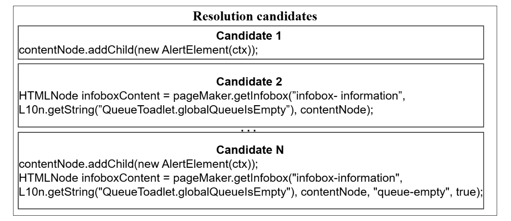

</details>

**Listing 2.** Resolution for the conflict displayed in Listing 1.

```java
1  contentNode.addChild(new AlertElement(ctx));
2  HTMLNode infoboxContent = pageMaker.getInfobox("infobox-information", L10n.
       ↪ getString("QueueToadlet.globalQueueIsEmpty"), contentNode, "queue-
       ↪ empty", true);
```

The advantage of using SBSE in merge conflict resolution is that it may guide the process of generating and evaluating multiple possible resolutions, reducing the manual burden on developers. By leveraging search algorithms, SBSE explores the solution space to identify optimal or near-optimal candidates that satisfy predefined criteria. As shown by Campos Junior et al. [2024], the search space for possible resolutions can be greatly reduced when considering specific heuristics. However, evaluating the quality of these candidates remains a challenge. Traditional methods of validation, such as running unit tests or compiling the code, are computationally expensive, especially when dealing with a large number of candidates. Therefore, the focus of this paper is on developing a method to efficiently evaluate the quality of SBSE-generated candidates while ensuring that the chosen resolution aligns with the developer's intent.

---

¹ https://github.com/hyphanet/fred

² According to Campos Junior et al. [2024], the formula to calculate the number of possible combinations for a conflict with n lines is Σᵢ₌₁ⁿ n!/(n-i)!.

---

## 3 Materials and Methods

In this section, we present the materials and methods used in this paper.

### 3.1 Research Questions

The six research questions we focus on in this paper are:

**• RQ1: How similar are conflict resolutions to each of their parents?**

In the first research question, we investigate the similarity between the conflict resolution (R) and its parent versions (P₁ and P₂). Considering that, in essence, a branch merge is supposed to conciliate the intentions of both branches, we hypothesize that the conflict resolution preserves the characteristics of the conflict parents, and thus, they are similar to a certain degree.

**• RQ2: Is there a correlation between the similarity of random conflict resolution candidates with each of the conflict's parents and with the conflict resolution?**

The second research question investigates whether the similarity between randomly generated resolution candidates (C) and the conflict's parent versions (P₁ and P₂) correlates with the similarity of that candidate to the final resolution (R). For each conflicting chunk, when possible, we generate 1,000 unique random candidates (C) by combining lines from its parent versions. For small chunks that do not reach 1,000 unique candidates, we generate all possibilities. This approach reflects the challenge faced during the merge process: the final resolution (R) is unavailable at that stage, making direct evaluation of candidates infeasible. By analyzing the correlation between Sim(Cᵢ, Pₙ) (the similarity between a candidate i and each parent n, where n = {1, 2}) and Sim(Cᵢ, R) (the similarity between a candidate i and the resolution), we aim to determine whether parent similarity can reliably serve as a proxy for evaluating candidate resolutions. If a positive correlation exists, parent similarity could theoretically serve as a practical metric for guiding automated conflict resolution approaches.

**• RQ3: How do different parents' similarity aggregation functions impact the correlation with conflict resolution?**

We are also interested in aggregating the similarities between candidates and both of their parents. Simplifying the problem from multi-objective to single-objective is particularly important in this context. In a multi-objective scenario, there is no single optimal solution; instead, a Pareto front is produced, representing multiple solutions that balance the trade-offs between different objectives. Practically, this would result in a larger set of potential candidates being presented to resolve the conflict, adding a layer of complexity for automated approaches or developers to make a final decision. By transforming the problem into a single-objective one, we aim to maximize the similarity with the aggregated parents, providing a clear and singular metric to guide the selection process. Thus, in the third research question, we investigate which aggregation function has the highest correlation between the similarity of the candidates with their parents and with the conflict resolution. We investigate the functions mean, harmonic mean, min, and max. We explain each of them in Subsection 3.5.

**• RQ4: Why do some chunks show a strong correlation and others do not?**

In the fourth research question, we further explore the correlations found in RQ2 and RQ3. Our goal is to find an explanation of why some chunks are more correlated than others. The analysis procedures are further discussed in Subsection 3.6.

**• RQ5: How effective is parent similarity as an evaluation function for guiding the generation of conflict resolution candidates?**

In the fifth research question, we leverage the findings from the previous research questions to manually investigate whether randomly generated candidates can be used to resolve the conflicting chunks and how they compare to the conflict resolution. The details for this analysis are described in Subsection 3.7.

**• RQ6: How effective is a search-based approach guided by parent similarity in resolving merge conflicts?**

In this research question, we build upon the findings from the previous questions to implement a search-based approach for conflict resolution. The approach leverages parent similarity as a heuristic to guide the generation and selection of resolution candidates. We evaluate its effectiveness by comparing the generated resolutions with the actual developer-written resolutions in terms of similarity. This evaluation allows us to assess whether parent similarity can successfully drive automated conflict resolution in practice.

### 3.2 Data Collection

Ghiotto et al. [2020] conducted a large-scale data collection on conflicts in 2016, beginning with an initial selection of 1,977,541 GitHub projects. They filtered this pool to include only projects with activity within the year preceding the data collection, and further restricted it to Java projects. Explicit forks of other projects were excluded. The selected projects were cloned, and 960,366 merges were replayed. This extensive process resulted in data from 2,731 projects, comprising 25,328 failed merges and a total of 175,805 conflicting chunks. We refer the reader to the original dataset paper for details about the collection process [Ghiotto et al. 2020].

Building on this dataset, we follow the methodology of Campos Junior et al. [2024], who focused on the feasibility of resolving conflicts by rearranging existing lines. We specifically consider only those chunks where developers resolved the conflicts by combining the conflicting lines in any order. From the 10,177 chunks analyzed by Campos Junior et al. [2024], we discarded 179 chunks with empty resolutions or empty chunk content, resulting in a final dataset of 9,998 conflicting chunks. These chunks occurred across 5,266 merges from 1,062 popular open-source GitHub Java projects. Table 1 provides statistics on the projects in the dataset, including that, on average, the projects have 3,160 commits and 20 developers contributing over time.

**Table 1.** Statistics about the projects used in the study.

| Characteristic | Mean (std. deviation) | Median |
|----------------|----------------------|--------|
| Number of commits | 3,160 ± 10,777 | 963 |
| Number of merges | 562 ± 5,066 | 72 |
| Number of failed merges | 38 ± 126 | 12 |
| Number of developers | 20 ± 31 | 9 |
| # of Chunks per project | 9 ± 26 | 2 |
| # of Merges per project | 5 ± 12 | 2 |

For each conflicting chunk of the dataset, we have the following information available to be analyzed: V₁ content, V₂ content, and conflict resolution content. To identify the resolution content, the approach used by Ghiotto et al. [2020] performs a diff between the conflicting and resolved versions of the file. By combining the line indexes of the prefix and suffix with the diff output (which indicates added and removed lines), it calculates the updated indexes where the resolution is located. This method ensures accurate identification even when the prefix and suffix content is not unique within the file, as it relies on line positions rather than content matching. For example, if a line originally at position five has three lines removed before it, its new position becomes two. This strategy results in a robust and precise localization of the resolution region. Figure 2 shows a diagram summarizing the objects analyzed in each research question.

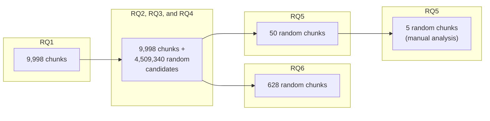
```mermaid
---
config:
  flowchart:
    nodeSpacing: 30
    rankSpacing: 50
---
flowchart LR
    subgraph RQ1["RQ1"]
        A["9,998 chunks"]
    end

    subgraph RQ234["RQ2, RQ3, and RQ4"]
        B["9,998 chunks +<br/>4,509,340 random<br/>candidates"]
    end

    subgraph Branches[" "]
        direction TB
        subgraph RQ6["RQ6"]
            E["628 random chunks"]
        end
        subgraph RQ5a["RQ5"]
            C["50 random chunks"]
        end
    end

    subgraph RQ5b["RQ5"]
        D["5 random chunks<br/>(manual analysis)"]
    end

    A --> B
    B --> C --> D
    B --> E

    style Branches fill:transparent,stroke:none
```

**Figure 2.** Diagram illustrating the datasets used for each research question.

<details>
<summary>View as image</summary>

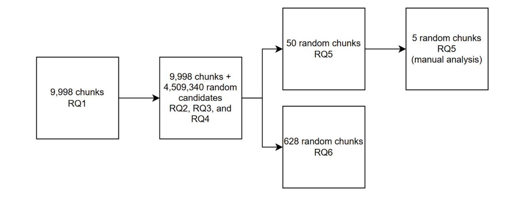

</details>

Our study addresses several research questions. For RQ1, we examined the similarity between conflict resolutions and their parent versions (Sim(R,V₁) and (Sim(R,V₂))) across 9,998 conflicting chunks. Building upon these initial findings, RQs 2 through 5 further explore aspects of similarity relationships and the resolution search space. Finally, for RQ6, we proposed, implemented, and evaluated a search-based conflict resolution (SBCR) approach that incorporates insights from the preceding RQs. The SBCR approach was assessed on a subset of 628 conflicting chunks by comparing its generated resolutions to those implemented by developers. The specific procedures for each research question are detailed in the subsequent sections.

### 3.3 Random Candidates Generation

To answer RQ2 (which investigates whether there is a correlation between the similarity of random conflict resolution candidates with each of the conflict's parents and with the conflict resolution), RQ3 (which examines how different parents' similarity aggregation functions impact this correlation), RQ4 (which seeks to understand why some chunks show a strong correlation while others do not), and RQ5 (which evaluates the effectiveness of parent similarity as an evaluation function for guiding the generation of conflict resolution candidates), we use randomly generated conflict resolution candidates. We used the algorithm described in Algorithm 1 to generate these candidates, respecting the partial order from V₁ and V₂, since according to Campos Junior et al. [2024], 98.6% of the resolutions preserve the partial order.

**Algorithm 1:** Partial Order Random Candidate Generation: generateRandomCandidate()

```
Data: Two conflicting versions: v₁ and v₂, which are represented by list of text lines
Result: A randomly generated candidate resolution

1  candidate ← [];
2  while v₁ ≠ ∅ or v₂ ≠ ∅ do
3      if v₁ ≠ ∅ and v₂ ≠ ∅ then
4          side ← randomly choose between v₁ and v₂;
5      else if v₁ ≠ ∅ then
6          side ← v₁;
7      else
8          side ← v₂;
9      end
10     if randomly choose { True, False } then
11         side.pop(0);
12     else
13         candidate.append(side.pop(0));
14     end
15 end
16 return candidate
```

As stated earlier, our goal was to generate 1,000 unique random candidates for each conflict in the dataset. However, it is only feasible to generate 1,000 unique random candidates that respect the partial order of the conflicting lines for chunks with at least 10 lines of code (LOC). Because not all chunks have at least 10 LOC, in our dataset there are 3,817 conflicting chunks with 1,000 generated candidates and 6,181 chunks with less than 1,000 generated candidates. In total, 4,509,340 random resolution candidates were generated for the 9,998 conflicting chunks, which represents an average of 451 candidates per conflict.

To better illustrate the process, we show in Listing 3 a randomly generated candidate for the chunk displayed in Listing 1. This candidate uses lines 1 and 2 from V₁, and line 2 from V₂.

**Listing 3.** Randomly generated candidate example.

```java
1       contentNode.addChild(new AlertElement(ctx));
2   HTMLNode infoboxContent = pageMaker.getInfobox("infobox-information", L10n.
        ↪ getString("QueueToadlet.globalQueueIsEmpty"), contentNode);
3   HTMLNode infoboxContent = pageMaker.getInfobox("infobox-information", L10n.
        ↪ getString("QueueToadlet.globalQueueIsEmpty"), contentNode, "queue-
        ↪ empty", true);
```

### 3.4 Measuring Similarity

The Longest Common Subsequence (LCS) algorithm efficiently identifies the longest common subsequence between two sequences, maintaining the relative order of elements [Hirschberg 1975]. With a time complexity of O(m × n), where m and n are the lengths of the sequences, LCS is widely applied in text analysis, bioinformatics, and program merging. In the latter, LCS aids in resolving conflicts and automating the merging of code changes from multiple contributors, facilitating efficient collaboration [Mens 2002]. The output of LCS is the size of the longest common subsequence between two text fragments. To obtain a similarity measure between these fragments, we adapt the LCS output to range from 0% to 100% using the Gestalt pattern matching measure [Ratcliff, Metzener, et al. 1988]. Given the two source code fragments t₁ and t₂, we compute the similarity between them as:

$$Sim(t_1, t_2) = \begin{cases} 1, & \text{if } |t_1| + |t_2| = 0 \\ \frac{2 \times |LCS(t_1, t_2)|}{|t_1| + |t_2|}, & \text{otherwise} \end{cases}$$

In this formula, the numerator represents twice the length of the longest common subsequence, while the denominator sums the lengths of both fragments. The resulting value, referred to as the Gestalt Similarity, falls within the range of 0 to 1 (or 0% to 100%). A similarity score of 0 indicates that there are no common elements between the two code fragments, meaning they are entirely different. Conversely, a score of 1 signifies that the fragments are identical, sharing the exact same sequence of characters. The similarity is 1 when both fragments are empty, because they are equal. We measure the LCS at the character level to allow a fine-grained differencing between the source code fragments.

For each of the 9,998 conflicting chunks, we calculate the similarity of the conflict resolution to its V₁ parent (Sim(R,V₁)) and its V₂ parent (Sim(R,V₂)). In addition, for each of the 4,509,340 randomly generated resolution candidates (Cᵢ), we compute its similarity relative to the conflict resolution (Sim(Cᵢ, R)) and to each of the conflict's parents (Sim(Cᵢ, Pₙ)). Using these collected similarity values, we then calculate the correlation among them to answer the research questions.

To illustrate the similarity calculation, using the V₁, V₂ and resolution contents displayed in Listing 1, the similarity between the resolution and V₁ is 94.4% (0.944), and between resolution and V₂ is 92.6% (0.926). Based on the random candidate displayed in Listing 3, its similarity with V₁ is 70.3% (0.703) and with V₂ is 72.7% (0.727). Finally, the candidate similarity with the resolution is 75% (0.750).

### 3.5 Aggregation Functions

In the third research question, we investigate the use of four different aggregation functions—mean, harmonic mean, min, and max—to combine the similarity values between random candidates and each of the conflict parents. These aggregation functions provide a single similarity value for each candidate, effectively converting the multi-objective problem into a single-objective problem. Our analysis explores how these functions impact the correlation between the similarity of conflict resolution candidates with both conflict parents and the actual conflict resolution.

The **mean** aggregation function calculates the arithmetic average of the similarity scores, providing a balanced representation of the candidate's resemblance to the conflict parents. It offers simplicity and robustness by evenly weighing all similarity values. However, the mean may overlook extreme values, potentially affecting the correlation with conflict resolution if outliers hold significant relevance.

Contrarily, the **harmonic mean** incorporates each similarity score's reciprocal before averaging, accentuating the influence of smaller values. This function is beneficial for proportional data and aims to offer a conservative estimate of similarity. Yet, its sensitivity to minimal values could impact its effectiveness, especially in sparse or noisy data scenarios.

The **min** aggregation function selects the smallest similarity score among the inputs, emphasizing the most conservative estimate of similarity. While suitable for preserving the strictest pairwise resemblance, it may disregard valuable information from other similarity scores, potentially leading to a conservative bias in the aggregated measure.

Conversely, the **max** aggregation function selects the largest similarity score, prioritizing the strongest pairwise resemblance. This approach is beneficial for capturing optimistic estimates of similarity, but it may overemphasize outliers or noise in the data, potentially reducing the robustness of the aggregated measure.

For the example conflict displayed in Listing 1 and the random candidate displayed in Listing 3, the similarity between the candidate and the parents (V₁ and V₂) aggregated using the mean, harmonic mean, min, and max functions are 0.715, 0.714, 0.703, and 0.726, respectively.

### 3.6 Analysis of Similarity Discrepancies

To answer RQ4, which seeks to understand why some chunks show a strong correlation while others do not, we calculate the Sim_{r-p}-value. Given the similarity between a randomly generated candidate and the resolution (Sim_r), and the similarity between the same candidate and the aggregated chunk's parents (Sim_p), we define Sim_{r-p} = Sim_r − Sim_p. The closer Sim_{r-p} is to -1, the more similar the candidate is to the chunk's parents and the less similar to the resolution, and the closest Sim_{r-p} is to 1, the more similar the candidate is to the conflict resolution and the less similar to the parents. A Sim_{r-p}-value close to 0 indicates a balance between both similarities. As an example, the Sim_{r-p}-value for the candidate displayed in Listing 3 using the mean aggregation function for the parents is Sim_{r-p} = 0.750 − 0.715 = 0.035. This means that the candidate is a little more similar to the chunk's resolution than to the chunk's parents.

We rank the chunks based on their Sim_{r-p} values to focus on the extremes. Specifically, we identify chunks where the generated candidate is significantly more similar to its parents than to the resolution (i.e., Sim_{r-p} values close to -1) and chunks where the candidate is significantly more similar to the resolution than to its parents (i.e., Sim_{r-p} values close to 1). For these cases, we investigate whether the chunk, resolution, and candidate sizes have any impact on the Sim_{r-p} values. In addition, we manually analyze cases with the biggest and smallest Sim_{r-p} values, aiming to understand why the correlation between candidate-parent similarity and candidate-resolution similarity is weak or inconsistent in these scenarios.

### 3.7 Manual Sample Analysis

To answer RQ5, which evaluates the effectiveness of parent similarity as an evaluation function for guiding the generation of conflict resolution candidates, we analyzed in detail a sample of the data used in previous research questions. First, we randomly select 50 conflicting chunks from the dataset. We chose this number of conflicts to achieve a balance between feasibility and relevance. For each selected conflict, we plot the calculated similarities for all randomly generated candidates. The obtained plots show how the resolution space is distributed for each chunk when using the proposed similarities as an evaluation function for resolution candidates.

Following the initial visualization step for the 50 randomly selected chunks, we proceeded with a more detailed manual analysis on a smaller, representative subset to better understand the practical implications of using parent similarity as a guide. Recognizing that the relationship between candidate-parent similarity and candidate-resolution similarity might vary across conflicts, we aimed to capture this potential diversity. Therefore, we employed a purposive sampling strategy, selecting five chunks from the initial sample of 50. These specific chunks were chosen to represent different points across the spectrum of correlation strengths observed between the two similarity measures in the overall dataset, specifically targeting cases that approximate the lower whisker, first quartile (Q1), median, third quartile (Q3), and upper whisker correlation values. This approach allows contrasting scenarios regarding the effectiveness of parent similarity as a heuristic. For each of these five selected chunks, we then manually compared the source code of three distinct, randomly generated candidates against the ground truth resolution: (1) the candidate exhibiting the lowest similarity to the parents, (2) a candidate with intermediate similarity (approximately 0.5) to the parents, and (3) the candidate achieving the highest similarity to the parents. This comparative analysis simulates how increasing parent similarity might guide a potential search process towards the final resolution, enabling the assessment of the metric's utility across different correlation contexts.

---

## 4 Results

In this section, we present the results of our study based on the research questions outlined earlier. We analyze the data collected and provide insights into the similarities between conflict resolutions and their respective parents, the correlation between candidates and parents, and the implications of these findings for conflict resolution strategies.

### 4.1 RQ1: Is there a correlation between the similarity of conflict resolutions and each of their parents?

To address RQ1, we examined the similarity values between conflict resolutions and their parent versions (Sim(R,V₁) and (Sim(R,V₂))) across the conflicting chunks in our dataset. Figure 3 illustrates a box plot showing the distribution of these similarity values. Our analysis reveals that, on average, conflict resolutions have a similarity of 70.9% with V₁ and 70.2% with V₂. The medians are 79.8% and 79.4%, respectively.

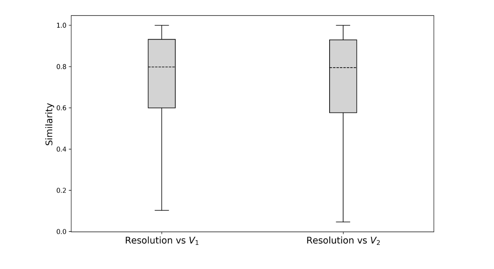

**Figure 3.** Similarity between conflict resolutions and each conflict parent (V₁ and V₂).

By analyzing the distribution of the similarities using the box plot from Figure 3, we observe that 75% of the chunk resolutions have more than 60% of similarity with both parents. Half of the chunks have at least 79% similarity between the resolution and both parents. These results suggest a substantial degree of similarity between conflict resolutions and each of their parent versions, indicating that both parents contribute significantly to the final resolution. Figure 4 shows a scatter plot for the similarity between the resolution and V₁ and between the resolution and V₂ parents.

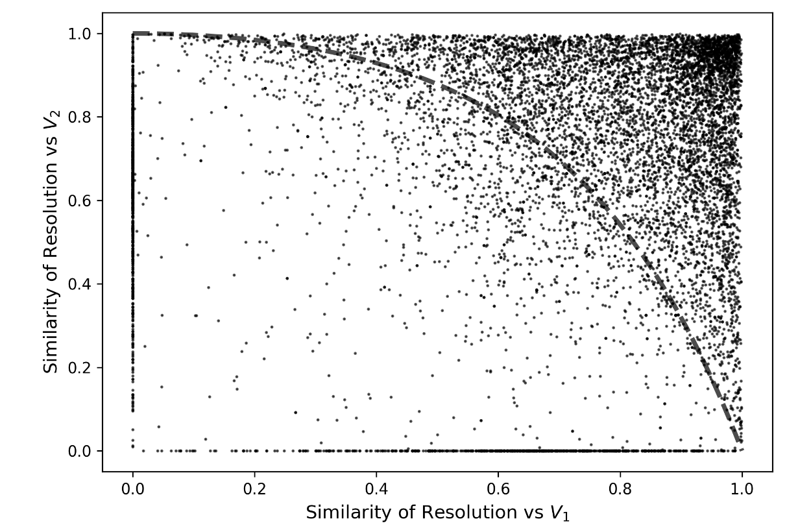

**Figure 4.** Scatter plot for the similarity between resolution and V₁ parent and resolution and V₂ parent.
> - Notable clusters along axes (zero similarity with one parent)
> - Dashed lines showing an imaginary curve dividing regions

Some noteworthy features can be observed in Figure 4. One notable pattern is the concentration of cases where there is zero similarity with one parent (V₁ or V₂) and some similarity with the other parent. These instances occur when one side is empty, indicating that the conflicting content was removed or moved elsewhere in that version while the other version has modified that content. This scenario occurs in 7.49% of the cases for V₁ and 7.22% of the cases for V₂.

Another significant feature in Figure 4 is the imaginary curve represented by the dashed lines from the y-axis to the x-axis, dividing the cases into two distinct regions. Below the curve, cases are scattered across the graph, while above the curve, there is a higher concentration of chunks, representing cases where the resolution is similar to both V₁ and V₂. Given the many cases where the resolution is very similar to each of the parents, we investigate the correlation between them in the next section.

> **Finding 1:** On average, conflict resolutions are about 70% similar to V₁ and V₂. Additionally, 75% of the chunk resolutions have more than 60% of similarity with each conflict parent (V₁ and V₂).

### 4.2 RQ2: Is there a correlation between the similarity of random conflict candidates with each of the conflict's parents and with the conflict resolution?

We divide the discussion regarding RQ2 in two parts. In the first part, we discuss the collected data putting all candidates from all chunks in the same bucket. This is intended to give an overview on the collected data. In the second part, we perform an analysis per chunk, which is intended to answer the research question.

The average similarity between the generated candidates and the parent V₁ (Sim(Cᵢ,V₁)) is 60.6%. Similarly, the average similarity between the generated candidates and the parent V₂ (Sim(Cᵢ,V₂)) is 61%. Regarding the similarity between the candidates and the resolution (Sim(Cᵢ, R)), the average value is 63%. The standard deviations are 22.4%, 22.2%, and 18.6%, respectively.

Figure 5 shows the distribution of the similarities between conflict resolution candidates and each parent, V₁ and V₂, respectively, when considering all candidates from all chunks. Since there is a very large number of data points (more than four million), we grouped neighbor points into regions in the plot and reported the density of these regions. Darker areas represent a higher concentration of points, whereas lighter areas represent a lower concentration.

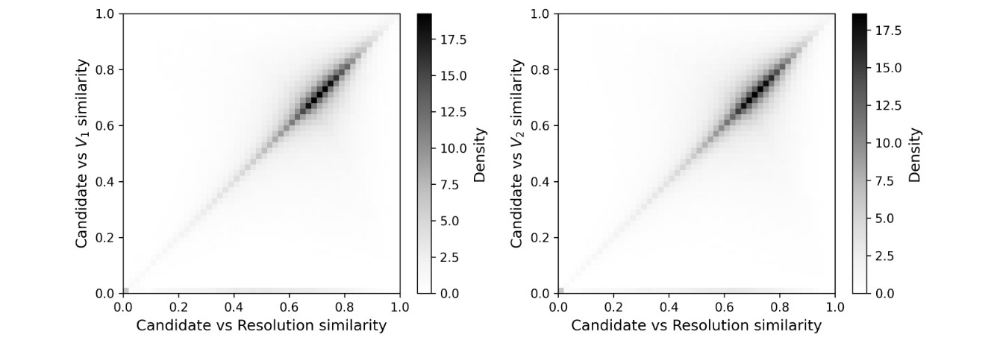

**Figure 5.** Distribution of similarities between generated candidates and their resolution and between the candidates and each parent.

Analyzing Figure 5, we observe an apparent correlation of the similarities between the candidates and V₁, and between the candidates and the resolution, since most of the data points seem to lie along the main diagonal of the plot. This suggests that when random candidates are similar to V₁, they are also similar to the resolution. There is also a higher concentration of cases on the upper end of the diagonal, which suggests that most of the candidates have a high degree of similarity (between 60% and 80%) with both V₁ and the resolution. The same patterns hold for the V₂ parent (right plot). There is also a small concentration of chunks along the horizontal axis where the similarity between the candidates and V₁ or V₂ is 0. This occurs when either V₁ or V₂ is empty, meaning that the content was removed by one version and modified by the other.

Moving to the next part of the analysis, we now analyze the data when grouped by chunk. This means that we calculate the similarities and correlations for each chunk and report aggregated measures aiming to answer our research question. Differently from the previous analysis, this analysis allows us to further understand the correlations in each chunk and how these measures are distributed in the dataset. Starting with the descriptive statistics, we found a value of 60.5% for the average similarity between the candidates and V₁, 60.9% for the average similarity between candidates and V₂, and 64.1% for the average similarity between candidates and the conflict resolutions. The standard deviations are 19.4%, 19.4%, and 19.1%, respectively.

Figure 6 presents box plots for the average similarities between random candidates, each conflict parent (V₁ and V₂), and the conflict resolution for the per-chunk analysis. The average median similarity is 61.4% for V₁, 61.8% for V₂, and 66.1% for the resolution.

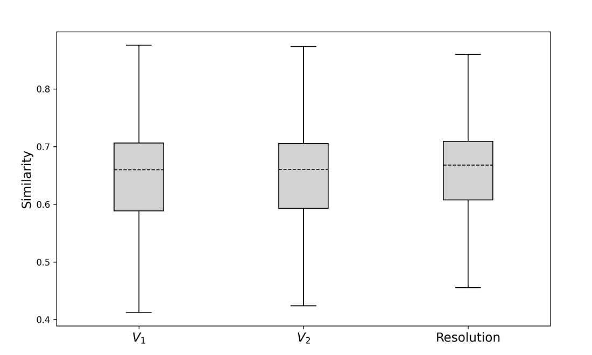

**Figure 6.** Box plots showing the average similarity between random candidates and V₁, V₂, and the resolution.

We also analyzed the correlations between the variables on a per-chunk basis. For each chunk, we calculate the Spearman's Rank Correlation Coefficient [Hinkle et al. 2003] values between the similarities of candidates with each conflict parent, and between candidates and the conflict resolutions. We needed to exclude 197 chunks from this analysis because their correlation could not be calculated. The reason is very specific. It happens because they are small chunks, with either V₁ or V₂ without any lines and with a small number of unique random candidates. In these cases, the correlation is not calculated, since all similarity values between either V₁ or V₂ and the candidate are 0. We also discarded chunks where the calculated correlations are not significant. We use a 5% significance level (α < 0.05), which is common in software engineering studies. In total, 6,333 chunks were included in the correlation values reported below.

The average correlation between the similarities of candidates with the V₁ parent, and between candidates and the conflict resolutions is 0.513, with a standard deviation of 0.584. When considering the V₂ parent, the average correlation is 0.476, with a standard deviation of 0.609. Figure 7 shows the distribution of these correlation values.

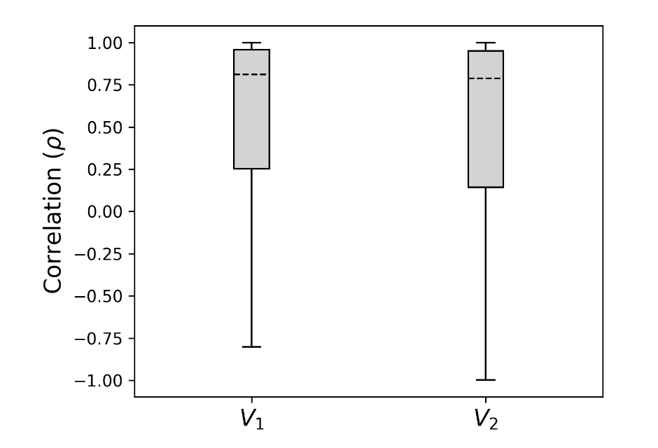

**Figure 7.** Distribution of average correlation (*ρ*) values between candidate-parent and candidate-resolution similarities.

Analyzing Figure 7, we observe a median correlation value of 0.811 for V₁, and 0.789 for V₂. These correlation values represent a strong correlation between the similarities of candidates with each conflict parent separately, and between candidates and the conflict resolutions.

> **Finding 2:** We found a strong average correlation (*ρ* = 0.811 and *ρ* = 0.789) between candidate vs. parent (V₁ or V₂) and candidate vs. resolution similarity. This suggests that, to some degree, when random candidates are similar to one of their parents, they are also similar to the resolution.

### 4.3 RQ3: How do different parents' similarity aggregation functions impact the correlation with conflict resolution?

In the previous RQ, we found a strong correlation between the similarities of the candidate and each parent and with the resolution. However, a natural question that arises is how we can aggregate the similarity of both parents. This is essential for transforming the multi-objective into a single-objective optimization problem. Thus, we investigate four different aggregation functions and their correlation with the resolution similarity. As we did in RQ2, we divide the discussion into two parts. In the first, we present the collected data when considering all chunks in the same bucket. The goal is to give an overview of the data. In the second part, we analyze the data per chunk, which will allow us to better understand the correlation distributions and answer the research question.

The average similarity between candidates and the chunks' parents is 60.8% for the Mean function, 55.4% for the Harmonic Mean function, 49.1% for the Min function, and 72.5% for the Max function. The average standard deviations are 15.5%, 21.9%, 21.9%, and 15.6%, respectively.

Figure 8 shows the distribution of the similarity values between candidates and their parents using the Mean, Harmonic Mean, Min, and Max aggregation functions when considering all candidates from all chunks. Since there is a very large number of data points (more than four million), we grouped neighbor points into regions in the plot and reported the density of these regions. Darker areas represent a larger concentration of points, whereas lighter areas represent a lower concentration.

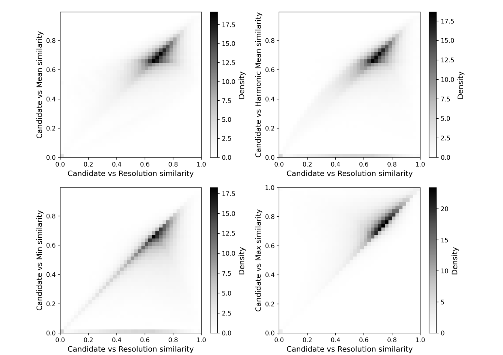

**Figure 8.** Distribution of similarity between all random candidates and parents using each aggregation function.

Analyzing Figure 8, one can observe a concentration of data points along the plot diagonal, indicating a correlation between the variables for all four aggregation functions. We can also observe some differences between the aggregation functions. When aggregated with the Harmonic Mean and the Min functions, some cases have a 0% value, i.e., these functions are more conservative and propagate the absence of similarity of the resolution to one of the parents. On the other hand, for the Max function, some cases reach a 100% value because the resolution is equal to one of the parents, hence the light gray points near the 100% similarity.

To confirm the apparent correlation in the collected data for the four functions, we calculated the Spearman's Rank Correlation Coefficient [Hinkle et al. 2003], which requires no assumption about the data distribution. We found a moderate correlation (*ρ* = 0.598, p-value < 0.01) between the candidate vs. parents' similarity aggregated with the Mean function and candidate vs. resolution similarity. The correlation is also moderate for the Harmonic Mean (*ρ* = 0.531, p-value < 0.01) and the Max function (*ρ* = 0.564, p-value < 0.01). For the Min function, the correlation is weak (*ρ* = 0.467, p-value < 0.01).

After analyzing the data considering all candidates from all chunks, we analyze the data grouping the candidates by chunk to answer our research question. We found an average similarity value of 60.7% for the Mean function, 52.8% for the Harmonic Mean, 47.2% for the Min, and 74.1% for the Max. The average standard deviations are 13.1%, 11.3%, 11.2%, and 17.6%, respectively. The average similarity between candidates and the resolution is 64.1%, with an average standard deviation of 19%. Figure 9 presents box plots illustrating the distribution of average similarity values obtained through each aggregation function, as well as the distribution of average similarities to the resolution. The average median similarity values observed were 62.9% for the Mean, 54.9% for the Harmonic Mean, 48.6% for the Min, 76.1% for the Max, and 66.1% for the Resolution.

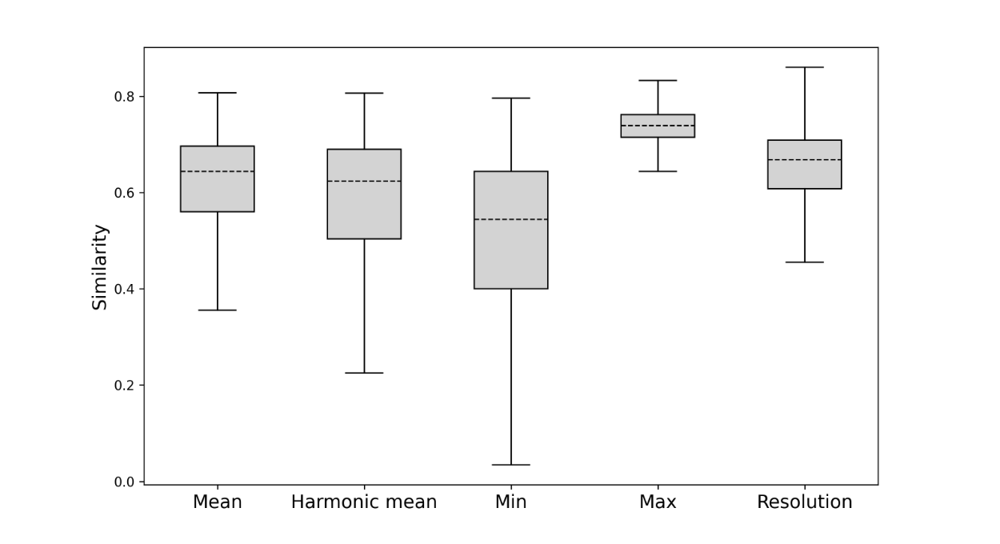

**Figure 9.** Box plots showing similarity with different aggregation functions.

From a visual inspection of the distributions displayed in Figure 9, it is possible to observe that the Mean and Harmonic Mean functions exhibit similarity distributions that are more aligned with that of the resolution. In contrast, the Min and Max functions produce distributions that deviate more substantially in both central tendency and dispersion. Although similar distributions do not necessarily imply statistical correlation, such resemblance may serve as an indication of a potential relationship, since correlated variables often display comparable distributional characteristics. These observations motivated a subsequent correlation analysis to better understand the relationship between the similarity of candidates to their parents and to the resolution.

For analyzing the correlation, for each chunk, we calculate the Spearman's Rank Correlation Coefficient [Hinkle et al. 2003] values between the similarities of candidates with the conflict parents using each aggregation function, and between candidates and the conflict resolutions. We needed to exclude 1,463 chunks from this analysis because their correlation could not be calculated for any of the aggregation functions. The reason is very specific. It happens because they are small chunks, with either V₁ or V₂ without any lines and with a small number of unique random candidates. In these cases, the correlation is not calculated, since all similarity values between either V₁ or V₂ and the candidate is 0. We also discarded chunks where the calculated correlations are not significant. We use a 5% significance level (α < 0.05), which is common in software engineering studies. In total, 6,138 chunks are included in the correlation values reported below.

The average correlation between the similarities of candidates with the parents aggregated using the Mean function, and between candidates and the conflict resolutions is 0.696, with a standard deviation of 0.348. When considering the Harmonic Mean function, the average correlation is 0.630, with a standard deviation of 0.407. For the Min function, the average correlation is 0.555, with a standard deviation of 0.452. Finally, for the Max function, the average correlation is 0.660, with a standard deviation of 0.390. Figure 10 shows the distribution of these correlation values.

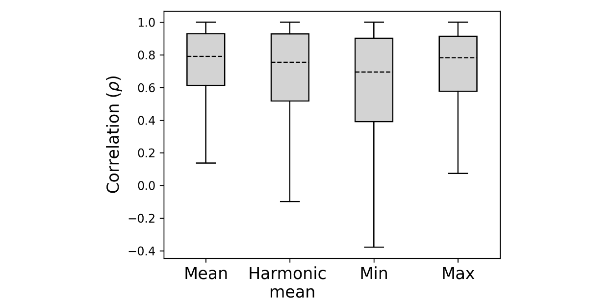

**Figure 10.** Distribution of average correlation (*ρ*) values for aggregation functions.

Analyzing Figure 10, we observe a median correlation value of 0.791 for the Mean function, 0.755 for the Harmonic Mean, 0.695 for the Min, and 0.783 for the Max. These median correlation values represent strong correlations. In the remainder of this paper, we will use the Mean aggregation function for the parents' similarity, since it has the strongest relationship with the resolution among all functions evaluated.

> **Finding 3:** All four aggregation functions showed a strong correlation with the similarity between the candidate and the resolution. The strongest relationship was found for the Mean function, with median *ρ* = 0.791.

### 4.4 RQ4: Why do some cases correlate and others do not?

Despite finding a strong correlation between the similarity of random candidates with the resolution and with the parents, there are some cases where this correlation doesn't hold. For instance, a candidate may have a high similarity with the resolution but a low similarity with the parents, or vice versa. In this research question, we investigate these cases.

As explained in Section 3.6, we use the Sim_{r-p}-value to identify cases with a low correlation. We focus our analysis on the highest and lowest Sim_{r-p}-values for the conflicting chunks in our dataset. Figure 11 shows a histogram with the distribution of the Sim_{r-p}-values in the dataset.

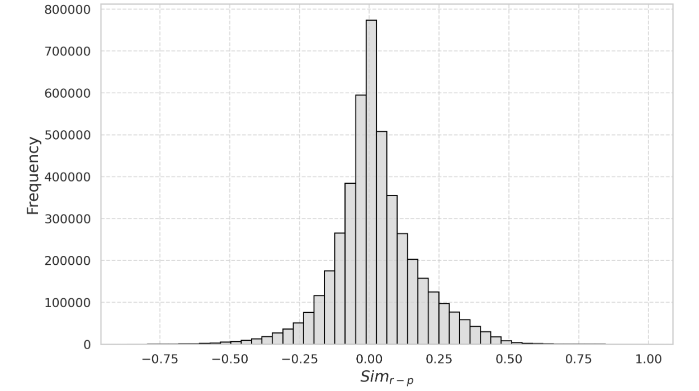

**Figure 11.** Histogram showing the Sim_{r-p}-values distribution in the dataset.

According to Figure 11, most cases are around a Sim_{r-p}-value of 0, indicating a balance between the similarities. Additionally, there is a tendency for candidates to be more similar to the resolution than to the parents, as shown by the greater number of cases on the right side of the histogram compared to the left. In fact, 54.4% of the cases have Sim_{r-p} > 0.

In the remainder of this section, we focus the analysis at both ends of the histogram. There are 11,135 candidates from 49 unique conflicting chunks with Sim_{r-p} < −0.5 and 11,246 candidates from 1,306 unique conflicting chunks with Sim_{r-p} > 0.5. We first visually investigated whether the sizes of the resolution, chunk, or candidate have any impact on the Sim_{r-p}-values. Figure 12 shows a scatter plot for these variables.

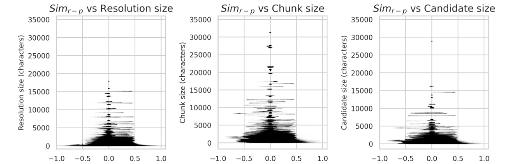

**Figure 12.** Scatter plot between Sim_{r-p}-value and resolution, chunk, and candidate sizes.

By analyzing the data distribution and the plots in Figure 12, for chunks with Sim_{r-p} < −0.5, the resolution size ranges from 6 to 362 characters, with 75% having up to 67 characters. The chunk size in these cases range from 134 to 8,324 characters, with 75% of them being up to 1,394 characters. For the candidate size, there are 673 candidates with 4,502 characters from the same conflict. It happens that this conflict is an outlier when comparing with the other chunks (75% of the conflicting chunks in the dataset have up to 962 characters). Hence, the reason for these large candidates is due to the conflict also being large. Besides these candidates, 75% of the remaining candidates from the chunks with Sim_{r-p} < −0.5 have up to 793 characters. For chunks with Sim_{r-p} > 0.5, the resolution size ranges from 6 to 2,185 characters, the chunk size ranges from 37 to 10,675 characters, and the candidate size ranges from 0 to 6,486 characters, with 75% of them having up to 232 characters. Based on these scatter plots, we found no clear visual correlation between the sizes of the resolution, chunk, and candidate, and the Sim_{r-p}-value.

However, the manual inspection of the scatter plots reveals some notable distribution patterns. The shape of the candidate size distribution appears to resemble the resolution size distribution more closely than the chunk size distribution, particularly for the cases with more than 5,000 characters. This observation supports the findings previously discussed in Figure 11, where candidate solutions tend to align more closely with the resolution than with the original conflicting versions.

Conversely, for smaller chunks (less than 5,000 characters), the distribution of candidate sizes is more similar to that of chunk sizes. In this context, the resolution size distribution exhibits a distinct downward stretch toward Sim_{r-p} = −1 and approaches zero size, reflecting cases in which the resolution retains minimal or no content from the parent versions. Despite these observations, we cannot conclude why there is correlation in some cases and not in others.

Since we could not explain the lack of correlation based on the individual sizes, we investigated some cases individually.

Moving forward to the manual analysis of extreme cases, we first ordered the cases by ascending Sim_{r-p} and analyzed the top 1,000 random candidates where Sim_{r-p} < −0.5, i.e., where the random candidates are much more similar to the parents than to the resolution. The candidate with the smallest Sim_{r-p}-value (-0.869) is from the project CloudStack-extras/CloudStack-archive. In this case, V₁ and V₂ have 27 and 19 lines, respectively, the resolution has only two lines, and the random candidate has 25 lines, where only one of them is the same as one of the resolution lines. The reason the candidate is much more similar to the parents than to the resolution is due to the difference in size between the candidate and the resolution. This difference is even greater when considering the size at the character level, which is used by our similarity metric. In this case, the candidate has 884 characters and the resolution has 22. By further inspecting the remaining top 999 cases where Sim_{r-p} < −0.5, we found this pattern consistent across most cases. Figure 13 shows a scatter plot for the chunk and resolution sizes, in terms of characters, for the dataset chunks. We highlighted in red the chunks where Sim_{r-p} < −0.5.

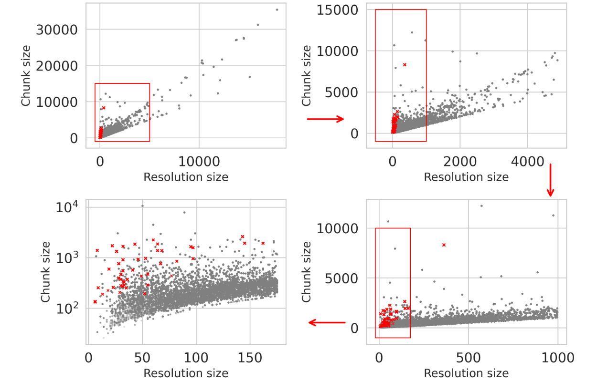

**Figure 13.** Scatter plot for the chunk size and resolution sizes of the chunks in the dataset.

According to Figure 13, all chunks with Sim_{r-p} < −0.5, i.e., chunks where the random candidate is more similar to the parents than to the resolution, exhibit a notable difference between the chunk and resolution sizes. Figure 14 shows the distribution of these differences for chunks with Sim_{r-p} < −0.5 and for the remaining chunks.

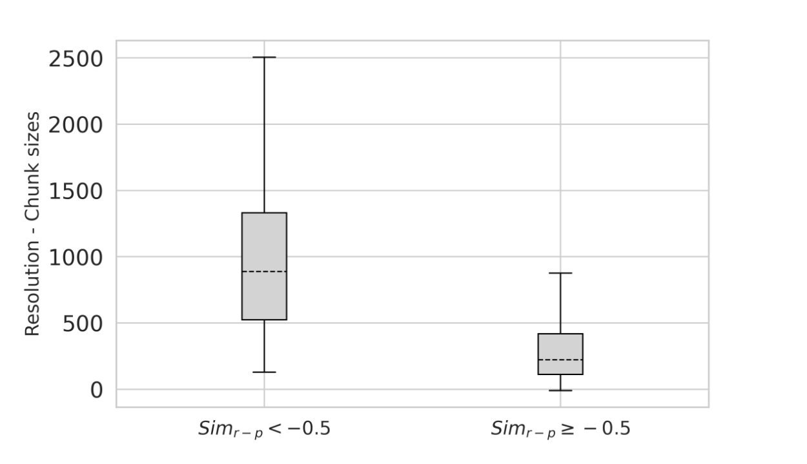

**Figure 14.** Comparison of the resolution and chunk sizes differences.

As shown in Figure 14, the difference in the conflicting content and resolution sizes is much larger for the chunks with Sim_{r-p} < −0.5 (median 887 LOC) than for the remaining chunks (median 222 LOC). This means that when generating a random candidate, the probability of choosing lines from the conflicting chunk that are not used in the resolution is higher than the usual case. Thus, the random candidate is likely to be more similar to the conflicting chunk than to the resolution.

To investigate this, we manually analyzed the resolutions of 10 random chunks from the 49 chunks with Sim_{r-p} < −0.5. We found that in 40% of the cases, the developers remove commented-out or unused sections, in 30% they consolidate similar operations, and in 30% they simplify error handling and logging. Based on this, we conclude that in this sample, resolutions tend to be much smaller than the original conflicts because developers focus on eliminating unnecessary or duplicated code, streamlining functionality, and ensuring consistency across the codebase.

> **Finding 4:** The lack of correlation in the cases with Sim_{r-p} < −0.5 is primarily due to the significant size differences between the chunk and its resolution. Developers tend to create concise resolutions by removing unused sections, consolidating operations, and simplifying error handling.

Similar to the previous analysis, we also investigated chunks at the other spectrum of the Sim_{r-p}-values, where Sim_{r-p} > 0.5, i.e., where the random candidates are much more similar to the resolution than to the parents. The conflict with the highest Sim_{r-p}-value (0.994) is from the project unclebob/fitnesse. In this case, V₁ has zero lines and V₂ has 35 lines. The random candidate has one line, which is the same as used in the resolution. In this case, the similarity between the candidate and V₁ is 0%, since V₁ has zero lines, and between the candidate and V₂ is 1.25%. Thus, the similarity between the candidate and the aggregated parents is 0.62%. In conclusion, in this case, the candidate is very similar to the resolution (100%) and the similarity with the parents is very low (0.62%), resulting in a Sim_{r-p}-value of 0.994. We observed that a similar trend happened for the other chunks with high Sim_{r-p}-values. For the first 1,000 candidates with the highest Sim_{r-p}-values, 955 (95.5%) of them have one parent empty. To confirm this observation, Figure 15 shows a scatter plot for the V₁ and V₂ sizes, in terms of characters, for each candidate in the dataset. We highlighted all 11,246 candidates with Sim_{r-p} > 0.5.

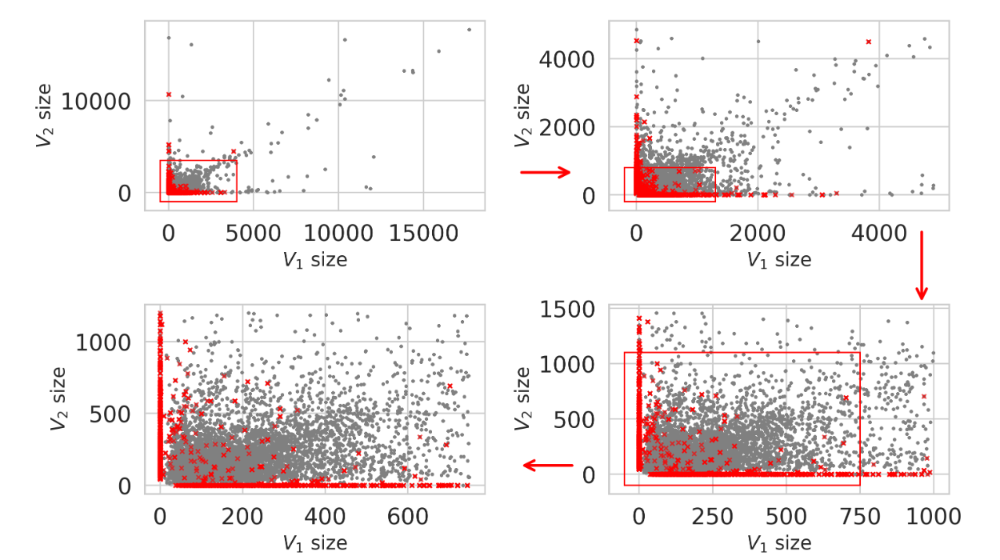

**Figure 15.** Scatter plot for the V₁ and V₂ sizes of the chunks for the generated candidates.

The analysis of Figure 15 shows that most (93.3%) of the candidates with Sim_{r-p} > 0.5 have either V₁ or V₂ with zero lines in the conflict. Thus, answering the research question, we may say that there is no correlation between the similarity of a random candidate and parents and the similarity between a random candidate and the resolution in these chunks because in most cases (i) one of the parents has zero lines and (ii) the generated candidate is very similar to the resolution.

> **Finding 5:** The lack of correlation for 93.3% of the cases with Sim_{r-p} > 0.5 is due to one of the parents having zero lines, while the generated candidate is very similar to the resolution.

### 4.5 RQ5: How effective is parent similarity as an evaluation function for guiding the generation of conflict resolution candidates?

As previously explained in Section 3.7, to answer RQ5, we first analyzed the distribution of the significant correlations (p-value < 0.05) between the similarity of candidates with the parents and their similarity with the resolution in our dataset. The lower whisker of the distribution (Q1 − 1.5 × IQR) is *ρ* = −0.05. This means that correlations below this threshold can be considered outliers. The first quartile (Q1) is *ρ* = 0.52, meaning that only 25% of the chunks have a correlation equal to or below 0.52. The median is *ρ* = 0.74. The third quartile (Q3) is *ρ* = 0.90, which means that 75% of the chunks have up to 0.90 correlation. Finally, the upper whisker of the distribution (1.5 × IQR + Q3) is 1.47. However, since the Spearman's Rank Correlation Coefficient values range from -1 to 1, we use *ρ* = 1.00 as the upper whisker. The median = 0.74 and Q3 = 0.90 suggest that parent similarity strongly correlates with resolution similarity in most cases, supporting its utility as an evaluation function. However, the lower quartile (Q1 = 0.52) highlights variability where parent similarity may be less predictive.

To visualize potential trends, we randomly selected 50 chunks from the dataset and plotted their candidate-parent vs. candidate-resolution similarities in Figure 16. These plots can be interpreted as visualizations of the search space, where each point represents a possible candidate resolution. The x-axis shows how similar a candidate is to the resolution, while the y-axis indicates how similar the same candidate is to the parents. This provides insight into how maximizing parent similarity (y-axis) might influence resolution similarity (x-axis) during the search process.

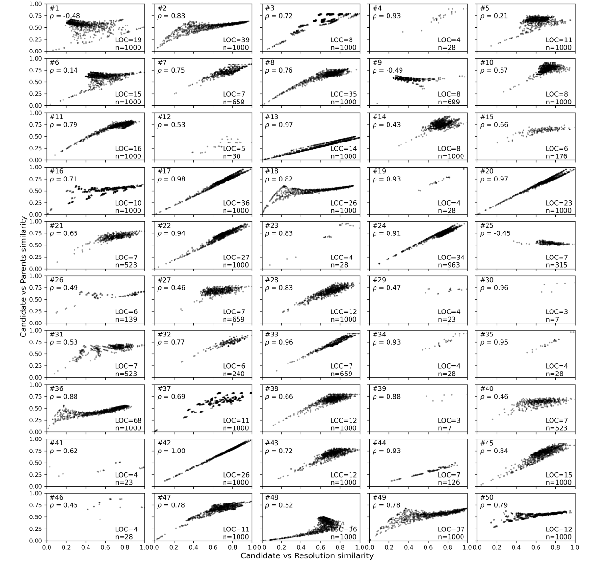

**Figure 16.** Scatter plots showing the relationship between candidate-parent similarity and candidate-resolution similarity for 50 chunks.
> - #7: *ρ* = 0.75, LOC=7, n=659
> - #13: *ρ* = 0.97, LOC=14, n=1000
> - #24: *ρ* = 0.91, LOC=4, n=28
> - #42: *ρ* = 1.00, LOC=4, n=23
>
> Plots show varying patterns from strong positive correlation (diagonal lines) to near-zero or negative correlations (scattered or inverse patterns).

Analyzing Figure 16, we observe different scatter shapes between the chunks. Some of them exhibit a very strong correlation (*ρ* ≥ 0.9): chunks #13, #17, #19, #20, #22, #24, #30, #33, #34, #35, #42, and #44. Despite having many very strong positive correlations, there are no chunks with very strong negative correlations. There are two negligible correlation cases (−0.3 ≤ *ρ* ≤ 0.3): chunks #5 and #6. Finally, there are three cases with weak negative correlations (−0.5 ≤ *ρ* ≤ −0.3): chunks #1, #9, and #25. When compared to other chunks in the dataset, these cases with negative correlations are outliers, representing only 8.2% (651/7968) of all cases with significant correlations.

Proceeding with our analysis, we selected five chunks from the sample of 50 displayed in Figure 16, that most closely resemble the correlations of the statistical distributions of the dataset. In this way, we selected chunk #6 (*ρ* = 0.14), representing the lower whisker (*ρ* = −0.05) of the dataset correlation distribution; chunk #31 (*ρ* = 0.53) representing the Q1 (*ρ* = 0.52); chunk #7 (*ρ* = 0.75) representing the median (*ρ* = 0.74); chunk #24 (*ρ* = 0.91) representing the Q3 (*ρ* = 0.90); and chunk #42 (*ρ* = 1.00) representing the upper whisker (*ρ* = 1.00). In essence, these cases should represent situations where the use of the similarity of candidates and the conflicting content gets incrementally higher, from the least correlated to the most correlated case.

To illustrate how parent similarity can guide the search towards the actual resolution, we manually analyzed the differences between randomly generated candidates and the developer's resolution at three key points for each of the five selected chunks: the candidate with the lowest parent similarity, a candidate with intermediate parent similarity (around 50%), and the candidate with the highest parent similarity. For brevity, we present the detailed difference visualizations only for the two extreme cases within our selected sample: chunk #6, which exhibits the lowest correlation (*ρ* = 0.14) and represents a scenario where parent similarity is expected to be a weaker guide, and chunk #42, which shows the highest correlation (*ρ* = 1.00) and represents a scenario where parent similarity is expected to be a strong guide. A summary of the similarity scores for all five manually analyzed chunks at these three stages (worst, intermediate, and best candidate) is provided in Table 2. The complete set of diff visualizations for all five chunks is available in our supplementary material [Campos Junior et al. 2025]. This gradient analysis across different correlation levels helps to understand the practical effectiveness and limitations of using parent similarity as an evaluation function.

**Table 2.** Comparison of candidate-to-parent and candidate-to-resolution similarity scores for the worst, intermediate, and best candidates (selected based on parent similarity) within five chunks chosen to represent the observed correlation (*ρ*) spectrum (min, Q1, median, Q3, max).

| Chunk | Worst: Parents | Worst: Resolution | Interm.: Parents | Interm.: Resolution | Best: Parents | Best: Resolution |
|-------|----------------|-------------------|------------------|---------------------|---------------|------------------|
| #6 (*ρ* = 0.14: min) | 2.6% | 3.5% | 50.1% | 55.3% | 71.2% | 96.1% |
| #31 (*ρ* = 0.53: Q1) | 7.9% | 7.9% | 50.0% | 52.8% | 71.6% | 82.0% |
| #7 (*ρ* = 0.75: median) | 25.1% | 20.7% | 49.3% | 50.3% | 88.5% | 100.0% |
| #24 (*ρ* = 0.91: Q3) | 10.7% | 9.8% | 50.9% | 47.2% | 95.1% | 97.0% |
| #42 (*ρ* = 1.00: max) | 11.1% | 10.8% | 50.2% | 50.7% | 97.1% | 98.4% |

We begin the detailed analysis with chunk #6, selected because its correlation (*ρ* = 0.14) represents the lower end of the typical correlation spectrum in our dataset (close to the minimum non-outlier value). Listing 4 illustrates the progression by showing the difference between the developer's resolution and three distinct candidates chosen based on their similarity to the parents. In the diff visualizations, a red strikethrough indicates characters to be removed from the candidate, while green characters represent additions needed to match the resolution; black and white (space) characters denote matches.

**Listing 4.** Progression of candidate quality for chunk #6 (*ρ* = 0.14) guided by parent similarity. Differences shown between the developer's resolution and candidates selected based on: (a) Worst parent similarity (2.6%), resulting in 3.5% resolution similarity; (b) Intermediate parent similarity (50.1%), resulting in 55.3% resolution similarity; and (c) Best parent similarity (71.2%), resulting in 96.1% resolution similarity.

| Candidate | Code Diff |
|-----------|-----------|
| **Worst candidate** | <code><del>}</del><b>final Collection&lt;ResourcePostProcessor&gt; processors = ProcessorsUtils.filterProcessorsToApply(minimize, resourceType, allPostProcessors);</b></code><br><code><b>final String output = applyPostProcessors(mergedResource, processors, content);</b></code> |
| **Interm. candidate** | <code><i>final </i><del>S</del><b>Collect</b><del>riong</del><b> &lt;Res</b><del>output = apply</del><b>rce</b><del>PostProcessors(</del><b>&gt;</b><i> processors,</i><del> content);</del></code><br><code><del>if (!minimize) {</del></code><br><code><del>——</del><b>   =p</b><i>Processors</i><del>——=——</del><b>Utils.filterProcessorsUti</b><del>ToApp</del><b>ls.getMy(minimize</b><del>F,</del><b>    ree</b><del>Pr</del><b>sources</b><del>s</del><b>Type,</b></code><br><code><b>allPo</b><del>rs(pt</del><b>Processors);</b></code><br><code><del>}</del></code><br><code><i>final String output = </i><del>LOG.debug("</del><i>applyPostProcessors</i><del>: {}"</del><i>(</i><b>mergedResource,</b><i> processors, content);</i></code> |
| **Best candidate** | <code><i>final Collection&lt;ResourcePostProcessor&gt; processors = ProcessorsUtils.filterProcessorsToApply(minimize, resourceType, allPostProcessors);</i></code><br><code><i>final String output = applyPostProcessors(</i><b>mergedResource,</b><i> processors, content);</i></code> |

<details>
<summary>View as image</summary>

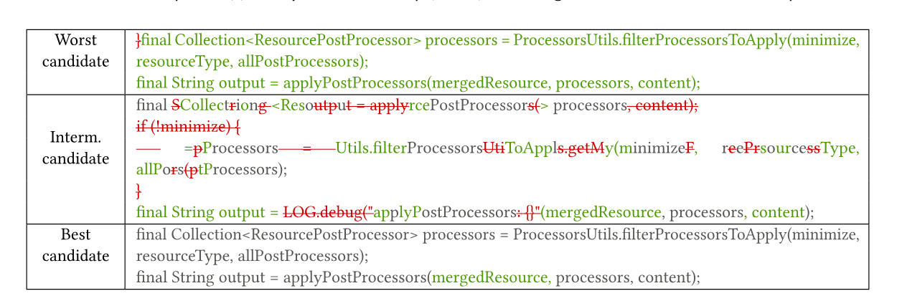

</details>

The first visualization in Listing 4 depicts the non-empty candidate least similar to the parents (2.6% parent similarity). This candidate exhibits very low similarity to the actual resolution (3.5%), essentially only matching initial whitespace and requiring substantial developer effort (e.g., removing brackets, adding significant code). Moving to the intermediate case, the second visualization shows a candidate with 50.1% parent similarity, which achieves 55.3% similarity to the resolution. While parts of this candidate align better with the target, considerable modifications would still be needed. Finally, the third visualization presents the candidate that maximized parent similarity within our random sample (71.2%). Remarkably, this candidate achieves a high similarity (96.1%) to the developer's resolution, requiring only a minor modification (adding a parameter to a method call). This detailed view of chunk #6 demonstrates that even when the overall correlation between parent and resolution similarity is weak, maximizing parent similarity can still effectively guide the search towards a near-optimal or highly similar resolution.

**Listing 5.** Progression of candidate quality for chunk #42 (*ρ* = 1.00) guided by parent similarity. Differences shown between the developer's resolution and candidates selected based on: (a) Worst parent similarity (11.1%), resulting in 10.8% resolution similarity; (b) Intermediate parent similarity (50.2%), resulting in 50.7% resolution similarity; and (c) Best parent similarity (97.1%), resulting in 98.4% resolution similarity.

| Candidate | Code Diff |
|-----------|-----------|
| **Worst candidate** | <code><b>final String arrayKey = rs.getString("array_key");//NOI18N</b></code><br><code><b>final Integer key = new Integer(rs.getInt("child"));//NOI18N</b></code><br><code><b>final String father_pk = rs.getString("father_pk");//NOI18N</b></code><br><code><b>final int father</b><i> =rs.getInt</i><b>("father");//NOI18N</b></code><br><code><b>final String attribute = rs.getString("attribute");//NOI18N</b></code><br><code><b>final String child_table</b><i>= rs.getString</i><b>("child_table");//NOI18N</b></code><br><code><b>final String father_table = rs.getString("father_table");//NOI18N</b></code><br><code><b>final String child_pk = rs.getString("child_pk");//NOI18N</b></code><br><code><b>final String value = "Select " + father + " as class_id ," + father_pk + " as object_id" + " from "//NOI18N</b></code><br><code><b>+ father_table</b></code><br><code><b>+ " where " + attribute + " in "</b></code><br><code><b>+ " (select " + arrayKey + " from " + child_table + " where  " + child_pk + " = ";// ? )</b></code> |
| **Interm. candidate** | <code><b>final String arrayKey = rs.getString("array_key");//NOI18N</b></code><br><code><b>final Integer key = new Integer(rs.getInt("child"));//NOI18N</b></code><br><code><b>final String father_pk = rs.getString("father_pk");//NOI18N</b></code><br><code><i>final St</i><del>ring</del><b>t</b><i>father</i><del>_</del><i>= rs.getInt("fa</i><del>b</del><i>ther");//NOI18N</i></code><br><code><i>final</i><del>S</del><i>tring attribute = rs.getString("attribute");//NOI18N</i></code><br><code><i>final String child_table = rs.getString("child_table");//NOI18N</i></code><br><code><i>final St</i><del>rin</del><b>t</b><i>g</i><del>father_</del><i>table= rs.getIn</i><b>S</b><i>tring("father_table");//NOI18N</i></code><br><code><i>final String child_pk = rs.getString("child_pk");//NOI18N</i></code><br><code><i>final String value = "Select " + father + " as class_id ," + father_pk + " as object_id" + " from "//NOI18N</i></code><br><code><i>+ father_table</i></code><br><code><i>+ " where " + attribute + " in "</i></code><br><code><i>+ " (select "</i><del>+</del><i> arrayKey</i><del>+</del><i> " from</i><del>"</del><i> + child_table + " where " + child_pk + " =</i><del>"</del><i>; // ? )</i></code> |
| **Best candidate** | <code><i>final String arrayKey = rs.getString("array_key");//NOI18N</i></code><br><code><i>final Integer key = new Integer(rs.getInt("child"));//NOI18N</i></code><br><code><i>final String father_pk = rs.getString("father_pk");//NOI18N</i></code><br><code><i>final int father = rs.getInt("father");//NOI18N</i></code><br><code><i>final String attribute = rs.getString("attribute");//NOI18N</i></code><br><code><i>final String child_table = rs.getString("child_table");//NOI18N</i></code><br><code><i>final String father_table = rs.getString("father_table");//NOI18N</i></code><br><code><i>final String child_pk = rs.getString("child_pk");//NOI18N</i></code><br><code><i>final String value = "Select " + father + " as class_id ," + father_pk + " as object_id" + " from "//NOI18N</i></code><br><code><i>+ father_table</i></code><br><code><i>+ " where " + attribute + " in "</i><b>//NOI18N</b></code><br><code><i>+ " (select " + arrayKey + " from " + child_table + " where " + child_pk + " = "; // ? )</i><b>//NOI18N</b></code> |

<details>
<summary>View as image</summary>

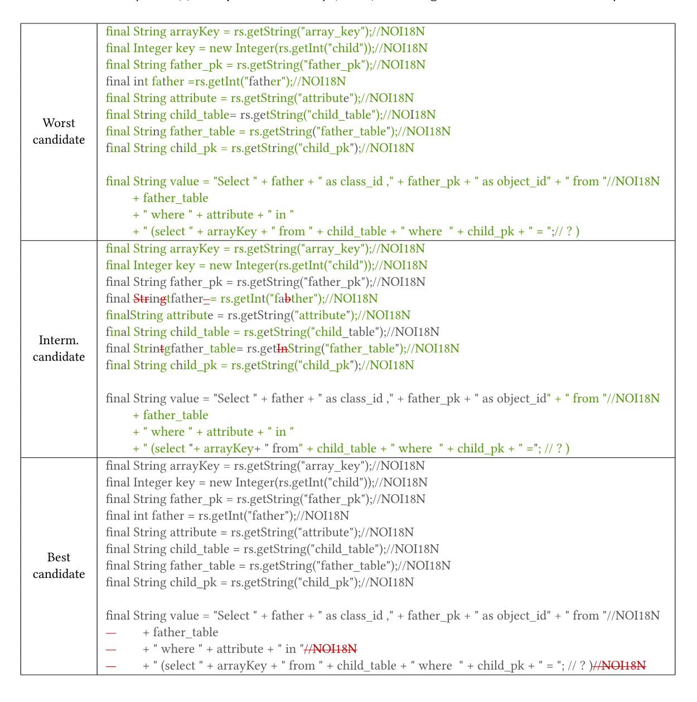

</details>

Next, we analyze chunk #42, which represents the upper extreme with a perfect correlation (*ρ* = 1.00) between candidate-parent and candidate-resolution similarities in our sample. Listing 5 presents the comparisons for this chunk at different levels of parent similarity. The first comparison shows the non-empty random candidate with the smallest similarity to the parents (11.1%). As expected in this high-correlation case, its similarity to the resolution is correspondingly low (10.8%). The second comparison displays an intermediate candidate possessing 50.2% similarity to the parents; its similarity to the resolution (50.7%) tracks closely, indicating progress towards the final merged code. Finally, the third comparison showcases the candidate achieving the highest similarity to the parents (97.1%). This candidate demonstrates a very high similarity to the actual resolution (98.4%), requiring only the removal of some comments to match perfectly. This high-correlation scenario clearly illustrates how maximizing parent similarity can effectively guide a search towards a candidate that is almost identical to the final developer resolution, necessitating only trivial modifications.

Our detailed examination of the extreme correlation cases (chunk #6, *ρ* = 0.14; chunk #42, *ρ* = 1.00) illustrates the practical implications of using parent similarity as a guide. In the high-correlation case (#42), maximizing parent similarity directly leads to a near-perfect resolution requiring minimal edits. Even in the challenging low-correlation case (#6), the candidate maximizing parent similarity was remarkably close (96.1%) to the final resolution. While we present only these extremes here for brevity, the summary results for all five analyzed chunks (Table 2) and the detailed diffs in the supplementary material further support this trend. Notably, in all five cases, the candidate with the highest parent similarity also exhibited very high similarity (over 80%, and often over 95%) to the actual resolution. The median case (#7) even yielded the exact resolution (100% similarity). Moreover, in all cases, the candidate-to-resolution similarity closely resembles the candidate-to-parents similarity. These findings suggest that maximizing parent similarity, despite occasional weaker correlations, generally serves as an effective evaluation function for guiding automated conflict resolution techniques, such as Search-Based Software Engineering (SBSE) approaches, towards developer-preferred resolutions.

> **Finding 6:** The similarity of a randomly generated conflict resolution candidate with its parents can be used as a guide to the similarity of the not yet known resolution of the conflict.

### 4.6 RQ6: How effective is a search-based approach guided by parent similarity in resolving merge conflicts?

To evaluate the practical applicability of parent similarity as a guiding function, we implemented a search-based approach for resolving merge conflicts, named Search-Based Conflict Resolution (SBCR). This approach formulates the resolution task as a combinatorial optimization problem, where the goal is to construct a candidate resolution that maximizes the mean similarity with the conflicting parents.

Our SBCR approach is based on the Random Restart Hill Climbing (RRHC) algorithm [Russell and Norvig 2022], which iteratively explores neighboring candidates derived from an initial random solution. Each neighbor is generated by applying one of three simple operations to the current candidate: adding a new line, removing an existing one, or swapping the positions of two lines. These operations define the neighborhood used during the local search process.

We tuned three key parameters of the approach using a random sample of 100 conflict chunks from our dataset:

- **Neighbors per iteration:** number of neighboring candidates evaluated per iteration;
- **Maximum execution time:** upper time bound for the approach;
- **Stagnation limit:** maximum number of iterations without improvement before terminating.

After experimentation, we selected the configuration that provided the best trade-off between similarity and execution time: 5 neighbors per iteration, 15 seconds of execution time, and a stagnation limit of 10 iterations.

To assess the effectiveness of SBCR, we applied it to 628 conflicting chunks from our dataset (excluding the ones used during parameter tuning). For each chunk, SBCR generated a candidate resolution, which we compared to the developer-written resolution using Gestalt Pattern Matching (Equation 1). We also measured the execution time for each run.

On average, SBCR produced candidates with 80.9% similarity to the developer resolution, with a standard deviation of 20.0%. Regarding execution time, SBCR takes an average of 4.1 seconds per chunk, with a standard deviation of 9 seconds.

Figure 17 shows the distribution of similarity scores (left) and execution times (right) for all 628 chunks. The median similarity achieved by SBCR is 86.5%, with 25.2% of the conflicts reaching 100% similarity. The median execution time is 2.56 seconds, and 75% of the conflicts are resolved in under 10.5 seconds. While execution time is influenced by parameter configuration, the timeout for this experiment was capped at 15 seconds. In some large conflicts, this limit may have been slightly exceeded to allow an ongoing iteration to complete before termination.

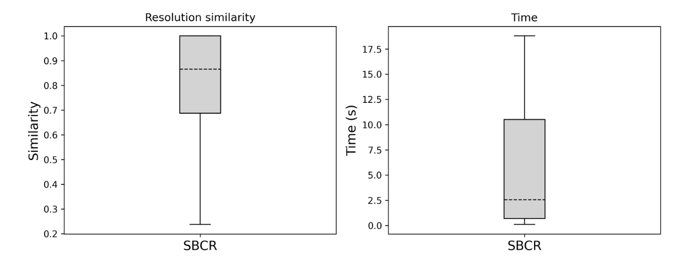

**Figure 17.** Box plots showing SBCR candidate similarity and generation time.

These results provide evidence that a search-based strategy guided by parent similarity is not only feasible but also effective in approximating human conflict resolutions. They reinforce the potential of parent similarity as a practical driver for automation. By leveraging this metric, SBCR consistently produces high-quality candidates that closely align with developer resolutions. This suggests that lightweight, similarity-guided search strategies can serve as efficient and scalable solutions for real-world merge conflict resolution.

> **Finding 7:** A search-based approach guided by parent similarity can generate conflict resolution candidates that closely approximate developer-written resolutions, achieving an average similarity of 80.9% across 628 merge conflicts, with an average execution time of 4.1 seconds.

### 4.7 Threats to Validity

**Conclusion validity** concerns the relationship between the treatment and the observed outcome. In our study, while our findings suggest a correlation between the similarity of random candidates and chunk's parents and between the candidates and resolutions, causation cannot be definitively established without further controlled experimentation. To mitigate this threat, we used a large dataset consisting of 9,998 conflicting chunks and applied Spearman's Rank Correlation Coefficient, which demonstrated significant correlations with a p-value below the conventional threshold. This statistical approach helps strengthen the evidence for a relationship, but further experiments are needed to confirm causality. Furthermore, specifically for the SBCR evaluation (RQ6), conclusions about its general performance should be drawn cautiously due to the dataset size of 628 conflicting chunks. Additionally, SBCR involves stochastic elements, and the parameter tuning phase involved single runs per configuration due to time constraints. This might mean the chosen parameters are not strictly optimal, potentially leading to a conservative estimate of SBCR's true capabilities. Future work should involve multiple runs during tuning and potentially expand the evaluation dataset to strengthen the conclusions.

In terms of **internal validity**, which refers to whether the observed outcomes are attributable to the study's setup rather than confounding factors, a general concern is the potential influence of variables like developer expertise, project complexity, or the specific context of a conflict on resolution patterns and outcomes. Although we mitigated this by analyzing a large and diverse set of projects and conflict instances, uncontrollable variables might still exist. To address a specific threat related to the SBCR evaluation (RQ6), we carefully managed the risk of overlap between data used for tuning its parameters and data used for evaluation. We ensured these datasets were strictly separated, so the reported performance reflects SBCR's generalization to unseen conflicts.

**Construct validity** pertains to whether our measurements accurately capture the concepts under investigation. A central construct is the "quality" or "correctness" of a merge resolution, which we primarily measured using textual similarity metrics between generated candidates and developer-provided resolutions (our ground truth). This presents a potential threat, as textual similarity may not fully capture semantic correctness or qualitative aspects like readability and maintainability; a semantically incorrect resolution could still exhibit high textual similarity. Moreover, we assume the developer's resolution is the desired target, but while this is common practice, this resolution is not guaranteed to be the objectively "best" or most correct solution. To mitigate these issues, we used established similarity metrics common in related literature. However, we acknowledge that similarity serves as a proxy, and future work could incorporate complementary evaluations, such as semantic analysis or manual inspection, to provide a more comprehensive assessment of resolution quality.

Finally, **external validity** concerns the generalizability of our findings to other contexts. Our study primarily used data from open-source Java projects hosted on GitHub (1,062 projects for the initial analysis, a subset for SBCR). Consequently, the findings might not directly generalize to proprietary or industrial software projects, which may have different team dynamics, code standards, or conflict types, nor necessarily to projects written in other programming languages or employing different development paradigms. To mitigate this, we used a large and diverse dataset of open-source projects, including a dataset utilized in previous related studies, aiming to capture a wide range of scenarios within this domain. Nonetheless, replication in different contexts, such as other programming languages and industrial projects, remains crucial future work to assess the broader applicability of our results.

---

## 5 Discussion and Practical Implications

In this section, we discuss the results and findings from this study.

**Leveraging the Findings to Create New Approaches:** Our findings provide valuable insights that form the basis for developing new approaches and tools for conflict resolution in collaborative development environments. The strong similarity between conflict resolutions and parent versions (RQ1) suggests that retaining significant content from both parents is often key to successful conflict resolution. This insight motivates the design of algorithms that prioritize preserving contributions from both parents, potentially reducing the need for extensive manual adjustments.

Furthermore, the strong average correlation found between the similarity of random candidates to their parents and their similarity to the final resolution (RQ2) indicates that parent similarity can serve as an effective proxy metric to guide the search for a correct resolution. The effectiveness of using the mean function to aggregate parent similarities (RQ3) reinforces this, providing a practical method for implementing such a guiding evaluation function. These findings support the feasibility of search-based techniques. Indeed, the Search-Based Conflict Resolution (SBCR) approach evaluated in RQ6 serves as a proof-of-concept demonstrating this principle in action, utilizing parent similarity within a specific optimization heuristic. While SBCR shows promising results, these foundational findings could also fuel the development of more sophisticated search algorithms (e.g., Genetic Algorithms, Simulated Annealing) leveraging the same core principle.

However, our analysis also identified situations where relying solely on parent similarity performs poorly, specifically when one of the conflicting versions (V₁ or V₂) is empty or when there is a substantial size discrepancy between them (RQ4). These conditions, which were recurrent in cases where our approach was less effective, can be detected a priori through simple heuristics. Consequently, this information could be exploited by a hybrid resolution strategy employing a selector mechanism. This selector could identify these unfavorable scenarios for search-based approaches and delegate those cases to alternative techniques better suited to handle them, such as rule-based systems (e.g., prioritizing the non-empty version) or specialized learning-based resolution strategies trained on such edge cases. By incorporating this decision-making step, future tools can dynamically adapt to the characteristics of each conflict, improving the overall robustness and effectiveness of the resolution process.

**Exploring the Use of Search-Based Techniques for Conflict Resolution:** As motivated by the findings above, search-based techniques present a promising avenue for conflict resolution. Our evaluation of SBCR in RQ6 provides concrete evidence for this. These algorithms typically rely on an evaluation function, and as our results strongly suggest, candidate similarity to parent versions is a practical and effective choice for this purpose. This approach leverages the observed correlation, using parent similarity as a proxy to estimate the potential quality of candidate resolutions, which can be produced by combining existing lines of the conflict.

The search landscapes visualized in Figure 16 for 50 different chunks (RQ5) further illustrate the potential and challenges. Using parent similarity as the evaluation function, we observed varied landscapes. Some (e.g., chunks #4, #7, #11, #13, and #47) present clear gradients where candidates with high parent similarity cluster near candidates with high resolution similarity, making them amenable to search algorithms like Hill Climbing or Genetic Algorithms. In these cases, the search algorithm can efficiently converge towards high-quality resolutions, as the evaluation function landscape provides clear guidance towards the optimal solutions.

However, other chunks, such as #1, #6, #9, #18, #40, among others, presented more challenging landscapes characterized by plateaus. In these scenarios, the lack of a gradient can cause search algorithms to stagnate, making it difficult to distinguish between good and suboptimal solutions. This highlights that while search-based techniques guided by parent similarity are viable, their effectiveness can be conflict-dependent, reinforcing the potential value of hybrid approaches or more sophisticated search strategies for challenging cases.

While previous discussions focused on the theoretical feasibility of using parent similarity to guide the search for conflict resolutions, the results from RQ6 confirm that this strategy is effective in practice. The SBCR approach, which operationalizes this idea, was able to generate candidate resolutions with an average similarity of 80.9% across 628 real conflicts. Furthermore, in 25.2% of the cases, SBCR produced a resolution identical to the one implemented by developers. This reinforces that search-based conflict resolution, when driven by a well-designed evaluation function, can approximate human decisions with high accuracy.

In terms of efficiency, SBCR demonstrated practical execution times, with a median of 2.56 seconds per conflict and 75% of the resolutions taking less than 10.5 seconds. These results suggest that the approach is not only effective but also suitable for integration into real-world development workflows, especially when deployed with tuned parameters and appropriate termination criteria.

SBCR represents a first step toward more effective conflict resolution approaches. While our approach currently focuses on resolutions composed from parent lines — covering 87% of conflicts [Ghiotto et al. 2020] — it does not address cases requiring new or modified lines (13%). However, by automating the majority of resolutions, SBCR reduces developer effort, even if only partial assistance is provided for some conflicts. There are several opportunities to improve the results, such as exploring alternative optimization algorithms, fine-tuning parameters, experimenting with new evaluation functions, and incorporating heuristics that capture conflict resolution patterns [Campos Junior et al. 2024]. Future work should also investigate extending SBCR to handle the remaining cases (13%) by integrating artificial intelligence techniques for generating new content or modifying lines beyond parent contributions. These enhancements could further broaden the applicability of search-based conflict resolution.

Altogether, these findings validate the use of lightweight similarity measures, such as parent similarity, as effective drivers for guiding automated resolution strategies. The practical results achieved by SBCR indicate that even in the absence of semantic or syntactic analysis, purely textual and structural information can be exploited to build efficient and accurate resolution tools. This opens up opportunities for developing lightweight, language-independent resolution strategies that are easy to adopt and scale across diverse codebases, potentially reducing developer burden and significantly streamlining collaborative workflows.

---

## 6 Related work

Several approaches have been proposed to address the problem of merge conflict resolution in collaborative software development. Traditional methods primarily rely on textual comparison of conflicting files. These methods, while straightforward, often fail to capture the semantics of the code, leading to unresolved or incorrectly resolved conflicts that disrupt developer workflows.

### 6.1 Structured and Semistructured Merge Approaches

In an effort to mitigate the limitations of textual approaches, structured merge methods, such as the one proposed by Apel, Leßenich, et al. [2012], leverage the structure of programming languages (e.g., syntax trees) to better understand the semantics of the code being merged. Although these methods offer improvements over purely textual merges, they tend to suffer from performance issues and scalability concerns when dealing with complex conflict scenarios. To address efficiency concerns, hybrid approaches combining textual and structured techniques were developed, as seen in the semistructured merge algorithms proposed by Apel, Liebig, et al. [2011] and Cavalcanti, Borba, Anjos, et al. [2024], and evaluated by Cavalcanti, Borba, and Accioly [2017]. However, even with these enhancements, such approaches continue to exhibit challenges such as false positive conflicts and difficulties in handling intricate conflict patterns, especially in large-scale projects.

### 6.2 Machine Learning Approaches

More recently, the use of machine learning (ML) for merge conflict resolution has gained attention. Techniques such as DeepMerge [Dinella et al. 2022], which applies deep learning models, and the approach of Zhang et al. [2022], which uses reinforcement learning, have shown promise in automating conflict resolution by learning from historical data. Similarly, Svyatkovskiy et al. [2022] leverage neural networks to predict the correct resolution for certain types of conflicts, while Dong et al. [2023] employ Large Language Models (LLM) to resolve conflicts with newly generated tokens, i.e., tokens that were not present in the conflicting lines. Although these ML-based methods have demonstrated impressive results, they heavily rely on the availability of quality historical data and may struggle with conflicts that deviate from patterns observed in past resolutions. Moreover, they still fail to handle more complex conflicts. For example, the state-of-the-art technique MergeGen was evaluated on conflicts where both the input and output were limited in size due to computational resource constraints. Specifically, the input was capped at 500 tokens and the output at 200 tokens [Dong et al. 2023]. For larger conflicts, the content was truncated, which could impact the performance and applicability of the approach.

### 6.3 Semantic Conflict Detection Approaches

Beyond traditional textual and structured merge techniques, there is a growing number of studies focusing on the detection of semantic conflicts. These conflicts arise when the merged changes lead to unexpected behavior in the program, even though no conflict is reported by textual or structured merge tools. Various approaches have been developed to detect semantic conflicts, including those based on static and dynamic analysis techniques. Static analysis approaches, such as those leveraging Program Dependence Graphs (PDGs) and System Dependence Graphs (SDGs), aim to detect potential interference between code changes by analyzing relationships and dependencies within the code without executing it [De Jesus et al. 2024]. These methods, while effective in identifying possible semantic issues, often face challenges in terms of scalability and the generation of false positives. On the other hand, dynamic analysis approaches, such as automated test case generation, detect conflicts by observing the program's behavior during execution. These methods are valuable for identifying conflicts that static analysis may miss, but they are typically resource-intensive and rely on extensive testing infrastructure [Da Silva et al. 2024; Moraes et al. 2024]. Both static and dynamic techniques offer valuable insights, but the trade-offs between false positives, computational cost, and coverage remain a significant challenge for large-scale software projects.

### 6.4 Search-Based Software Engineering (SBSE)

Another line of research relevant to this problem is Search-Based Software Engineering (SBSE), which applies optimization techniques by framing software engineering tasks as search problems. Harman and Jones [2001] laid the foundation for systematically applying search techniques in software engineering, highlighting the potential of optimization to tackle complex engineering tasks. In the context of merge conflict resolution, SBSE approaches are attractive because they enable for systematic exploration of large solution spaces to identify optimal or near-optimal candidate resolutions.

While some existing works employ optimization techniques (e.g. genetic algorithms or program synthesis), they do not explicitly frame the problem of merge conflict resolution as a search problem under the SBSE paradigm. That is, they do not conceptualize or present their solutions as SBSE approaches, nor do they leverage typical SBSE principles such as explicit definition of the search space, evaluation function, and a search strategy tailored for generalizability.

Zhu and He [2018] introduced AutoMerge, a method that generates candidate resolutions by combining and rearranging program elements involved in conflicts detected by structured merge tools. AutoMerge ranks these candidates, presenting the top-ranked ones to the user for acceptance or rejection. Although AutoMerge reached an impressive 95.1% resolution accuracy in its initial study, requiring only 1.79 user iterations per conflict on average, its evaluation was limited to a relatively small dataset of 244 conflicting chunks from 95 merges across 10 open-source projects. Later studies, such as Shen and Meng [2024], found that AutoMerge's accuracy dropped to 63.6% when tested on a different set of 77 conflicts, suggesting variability in the approach's effectiveness across different datasets.

Almost-Rerere, proposed by Gonzalez and Fraternali [2022], combines historical conflict resolutions with clustering and genetic algorithms to automatically resolve conflicts. By leveraging past resolutions, the system clusters similar conflicts and applies genetic algorithms to search for reusable patterns and replacement expressions. The approach was evaluated on 25 open-source projects with over 52,000 chunks. Almost-Rerere successfully synthesized resolutions for 49% of the conflicts and correctly replicated developer resolutions in 55% of these cases. However, the approach depends heavily on the quality of previous examples, limiting its generalizability across diverse projects and coding styles. In addition, the approach was not able to generate resolutions for 51% of the conflicts, only conflicts having up to 6 LOC were considered, and it depends on the developer to resolve conflicts that are not similar to the previous conflicts.

Additionally, Xing and Maruyama [2019] explored the integration of Automated Program Repair (APR) techniques into merge conflict resolution. Their approach uses APR systems to synthesize resolutions by automatically repairing conflicting class elements. Like Almost-Rerere, this method uses genetic algorithms to explore and identify potential solutions but has yet to undergo extensive validation in diverse software projects.

These studies indicate that while multiple directions are being explored, the limitations—whether in terms of dependency on historical data, scalability issues, or computational costs—remain significant. Importantly, although these studies adopt elements of search or optimization, none of them explicitly apply the SBSE perspective or fully embrace its principles. Thus, treating merge conflict resolution as a concrete SBSE problem remains an under-explored direction. In this context, our work contributes by proposing and evaluating a resolution approach explicitly grounded in SBSE, using a well-defined search space, a simple yet effective evaluation function based on parent similarity, and a search strategy (Random Restart Hill Climbing). We believe this opens a promising research avenue, especially for scenarios where traditional or machine learning techniques struggle due to high variability, lack of training data, or computational constraints.

### 6.5 Challenges in Validating Candidate Solutions

A key challenge for both ML and SBSE-based approaches is how to effectively validate candidate resolutions. While compilation and testing could be used to ensure the correctness of a merge, they are computationally expensive and may not be feasible for techniques that generate a large number of candidate solutions. Da Silva et al. [2024] proposed using tests to check if the behavior of the merged version preserves the intention of the contributions, i.e., it may be used to validate candidate resolutions. However, this approach may not scale well for search-based methods, which require frequent validation of many solutions during the search process. In this sense, we contribute to this body of knowledge showing that the search for good conflict resolution candidates can be guided using the similarity between candidate resolutions and the original parent versions as an evaluation function. More than that, we propose and evaluate SBCR, a Search-Based Conflict Resolution approach, which suggests that SBSE may be a feasible alternative or a complementary approach to existing methods in specific scenarios.

---

## 7 Conclusion

In this paper, we analyzed 9,998 conflicting chunks from 1,062 open-source GitHub Java projects to investigate the similarity between the conflict resolutions and the conflicting content. Additionally, we explored whether the similarity of randomly generated candidates with the conflicting content can be used as an evaluation function for a search-based conflict resolution approach.

Our analysis revealed that conflict resolutions are often closely aligned with the conflicting chunks' parents. This observation underscores the importance of the parents' content in guiding the resolution process. Furthermore, we showed that the similarity between the conflict's parents can be used as a strong predictor of the resolution's similarity. This insight can be leveraged to create new approaches for conflict resolution, particularly in developing evaluation functions for search-based algorithms. This is especially promising considering that existing approaches often use compilation and tests to assess the quality of potential candidates. Compilation and tests are usually costly operations, and their fidelity is highly dependent on the coverage of the test suite.

By simulating a simple search-based conflict resolution technique, we found that using the similarity with the conflict's parents as an evaluation function could effectively guide the search process. Our results show promising landscapes for certain chunks, where higher resolution similarities are closely aligned with higher parent similarities. However, other chunks present more challenging landscapes, with plateaus that could cause search stagnation.

By inspecting the data, we identified key attributes that differentiated chunks with good landscapes from those with more challenging ones. Chunks where the resolution has balanced contributions from both parents tended to have better search landscapes. In contrast, chunks where the resolution had larger disparities between parents' lines and greater differences in size and character counts posed more significant challenges.

Finally, based on these findings, we proposed SBCR, a Search-Based Conflict Resolution approach. SBCR leverages the Random Restart Hill Climbing (RRHC) optimization algorithm to generate high-quality candidates to resolve merge conflicts. We evaluated SBCR on 628 conflicting chunks from Java open-source projects. We found that the median similarity for the solutions found by the search for these chunks to the developer-provided resolution is 86.5%, which are generated in a median of 2.56 seconds. This result reinforces the strength of search-based approaches for supporting developers in resolving merge conflicts.

In summary, our findings provide a solid foundation for advancing conflict resolution techniques in collaborative software development. By understanding the critical role of the conflicting chunks' parents and leveraging this knowledge in search-based approaches, we can develop more effective methods to navigate and resolve conflicts.

Future work will focus on refining these techniques to handle cases where the conflict resolutions are not much similar to the conflict parents. Additionally, we intend to investigate the impact of using alternative similarity functions, like Jaccard Index, Euclidean Distance, and Cosine Similarity. Finally, we also intend to replicate the experiments on more merge scenarios, including scenarios from programming languages other than Java.

---

## 8 Acknowledgments

We thank the following entities for partially funding this work: Conselho Nacional de Desenvolvimento Científico e Tecnológico (CNPq) for the grant 309300/2023-1; Fundação Carlos Chagas Filho de Amparo à Pesquisa do Estado do Rio de Janeiro (FAPERJ) for the grants E-26/210.542/2024 and E-26/204.145/2024; and National Science Foundation (NSF) for the grant CCF-2210812. We also acknowledge the use of Grammarly and ChatGPT 4.o for improving the spelling, grammar, vocabulary, and style of the text. We also utilized ChatGPT 4.o to speed up the writing of Python code for the analyses, such as generating boilerplate code for different plots. We carefully examined, tested, and often corrected all suggestions, whereby we take full responsibility for the form and content of the paper.

---

## References

Sven Apel, Olaf Leßenich, and Christian Lengauer. 2012. "Structured Merge with Auto-Tuning: Balancing Precision and Performance." In: *Proceedings of the 27th IEEE/ACM International Conference on Automated Software Engineering* (ASE 2012). Association for Computing Machinery, New York, NY, USA, 120–129. ISBN: 978-1-4503-1204-2. DOI: 10.1145/2351676.2351694.

Sven Apel, Jörg Liebig, Benjamin Brandl, Christian Lengauer, and Christian Kästner. Sept. 2011. "Semistructured Merge: Rethinking Merge in Revision Control Systems." In: *Proceedings of the 19th ACM SIGSOFT Symposium and the 13th European Conference on Foundations of Software Engineering* (ESEC/FSE '11). Association for Computing Machinery, Szeged, Hungary, (Sept. 2011), 190–200. ISBN: 978-1-4503-0443-6. DOI: 10.1145/2025113.2025141.

Brad Appleton, Steve Berczuk, Ralph Cabrera, and Robert Orenstein. 1998. "Streamed lines: Branching patterns for parallel software development." In: *Proceedings of PloP*. Vol. 98, 14.

Alexander Boll, Yael Van Dok, Manuel Ohrndorf, Alexander Schultheiß, and Timo Kehrer. 2024. "Towards Semi-Automated Merge Conflict Resolution: Is It Easier Than We Expected?" In: *Proceedings of the 28th International Conference on Evaluation and Assessment in Software Engineering*, 282–292.

Heleno Campos Junior, Gleiph Menezes, Marcio Barros, Andre van der Hoek, and Leonardo Murta. 2025. *Supplementary Material for "Towards a feasible evaluation function for search-based merge conflict resolution"*. https://github.com/gems-uff/sbcr. GitHub repository. Accessed: 2025-04-28. (2025).

Heleno de Souza Campos Junior, Gleiph Ghiotto L de Menezes, Márcio de Oliveira Barros, André van der Hoek, and Leonardo Gresta Paulino Murta. 2024. "How code composition strategies affect merge conflict resolution?" *Journal of Software Engineering Research and Development*, 12, 1, 13–1.

Guilherme Cavalcanti, Paulo Borba, and Paola Accioly. Oct. 2017. "Evaluating and Improving Semistructured Merge." *Proceedings of the ACM on Programming Languages*, 1, OOPSLA, (Oct. 2017), 59:1–59:27. DOI: 10.1145/3133883.

Guilherme Cavalcanti, Paulo Borba, Leonardo dos Anjos, and Jonatas Clementino. 2024. "Semistructured Merge with Language-Specific Syntactic Separators." In: *2024 39th IEEE/ACM International Conference on Automated Software Engineering (ASE)*. IEEE.

Catarina Costa, José JC Figueiredo, Gleiph Ghiotto, and Leonardo Murta. 2014. "Characterizing the Problem of Developers' Assignment for Merging Branches." *International Journal of Software Engineering and Knowledge Engineering*, 24, 10, 1489–1508.

Léuson Da Silva, Paulo Borba, Toni Maciel, Wardah Mahmood, Thorsten Berger, João Moisakis, Aldiberg Gomes, and Vinícius Leite. 2024. "Detecting semantic conflicts with unit tests." *Journal of Systems and Software*, 214, 112070.

Galileu Santos De Jesus, Paulo Borba, Rodrigo Bonifácio, and Matheus Barbosa De Oliveira. 2024. "Lightweight Semantic Conflict Detection with Static Analysis." In: *Proceedings of the 2024 IEEE/ACM 46th International Conference on Software Engineering: Companion Proceedings*, 343–345.

Elizabeth Dinella, Todd Mytkowicz, Alexey Svyatkovskiy, Christian Bird, Mayur Naik, and Shuvendu Lahiri. 2022. "Deepmerge: Learning to merge programs." *IEEE Transactions on Software Engineering*, 49, 4, 1599–1614.

Jinhao Dong, Qihao Zhu, Zeyu Sun, Yiling Lou, and Dan Hao. 2023. "Merge Conflict Resolution: Classification or Generation?" In: *2023 38th IEEE/ACM International Conference on Automated Software Engineering (ASE)*. IEEE, 1652–1663.

Gleiph Ghiotto, Leonardo Murta, Márcio Barros, and André van der Hoek. 2020. "On the Nature of Merge Conflicts: A Study of 2,731 Open Source Java Projects Hosted by GitHub." *IEEE Transactions on Software Engineering*, 46, 8, 892–915. DOI: 10.1109/TSE.2018.2871083.

Sergio Luis Herrera Gonzalez and Piero Fraternali. 2022. "Almost Rerere: Learning to resolve conflicts in distributed projects." *IEEE Transactions on Software Engineering*, 49, 4, 2255–2271.

Mark Harman and Bryan F Jones. Dec. 2001. "Search-Based Software Engineering." *Information and Software Technology*, 43, 14, (Dec. 2001), 833–839. DOI: 10.1016/S0950-5849(01)00189-6.

Dennis E Hinkle, William Wiersma, and Stephen G Jurs. 2003. *Applied statistics for the behavioral sciences*. Vol. 663. Houghton Mifflin College Division.

Daniel S. Hirschberg. 1975. "A linear space algorithm for computing maximal common subsequences." *Communications of the ACM*, 18, 6, 341–343.

Bakhtiar Khan Kasi and Anita Sarma. 2013. "Cassandra: Proactive conflict minimization through optimized task scheduling." In: *2013 35th International Conference on Software Engineering (ICSE)*. IEEE, 732–741.

Tom Mens. 2002. "A state-of-the-art survey on software merging." *IEEE transactions on software engineering*, 28, 5, 449–462.

Amanda Moraes, Paulo Borba, and Léuson Silva. 2024. "Semantic conflict detection via dynamic analysis." In: *Anais do XXVIII Simpósio Brasileiro de Linguagens de Programação*. SBC, Curitiba/PR, 53–61. https://sol.sbc.org.br/index.php/sblp/article/view/30257.

Nicholas Nelson, Caius Brindescu, Shane McKee, Anita Sarma, and Danny Dig. Oct. 2019. "The life-cycle of merge conflicts: processes, barriers, and strategies." en. *Empirical Software Engineering*, 24, 5, (Oct. 2019), 2863–2906. DOI: 10.1007/s10664-018-9674-x.

John W Ratcliff, David E Metzener, et al.. 1988. "Pattern matching: The gestalt approach." *Dr. Dobb's Journal*, 13, 7, 46.

Stuart Russell and Peter Norvig. 2022. *Artificial Intelligence: A Modern Approach*. (4th ed.). Pearson, Upper Saddle River, NJ, USA. ISBN: 978-0134610993.

Bowen Shen and Na Meng. 2024. "ConflictBench: A benchmark to evaluate software merge tools." *Journal of Systems and Software*, 214, 112084.

Alexey Svyatkovskiy, Sarah Fakhoury, Negar Ghorbani, Todd Mytkowicz, Elizabeth Dinella, Christian Bird, Jinu Jang, Neel Sundaresan, and Shuvendu K Lahiri. 2022. "Program merge conflict resolution via neural transformers." In: *Proceedings of the 30th ACM Joint European Software Engineering Conference and Symposium on the Foundations of Software Engineering*, 822–833.

Xiaoqian Xing and Katsuhisa Maruyama. 2019. "Automatic software merging using automated program repair." In: *2019 IEEE 1st International Workshop on Intelligent Bug Fixing (IBF)*. IEEE, 11–16.

Jialu Zhang, Todd Mytkowicz, Mike Kaufman, Ruzica Piskac, and Shuvendu K Lahiri. 2022. "Using pre-trained language models to resolve textual and semantic merge conflicts (experience paper)." In: *Proceedings of the 31st ACM SIGSOFT International Symposium on Software Testing and Analysis*, 77–88.

Fengmin Zhu and Fei He. 2018. "Conflict resolution for structured merge via version space algebra." *Proceedings of the ACM on Programming Languages*, 2, OOPSLA, 1–25.
