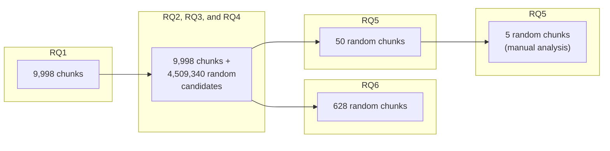

**Figure 2.** Diagram illustrating the datasets used for each research question. The analysis progresses from 9,998 initial chunks (RQ1), includes 4,509,340 generated candidates (RQ2-RQ4), and utilizes specific random subsets for RQ5 (50 chunks for visualization, 5 for manual analysis) and RQ6 (628 chunks).
